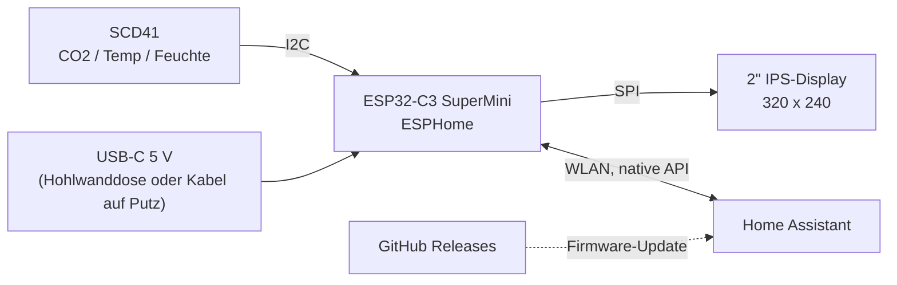

<div align="center">

# CO2-Wandsensor

**Kompakter CO2-, Temperatur- und Feuchtesensor für Home Assistant.<br>
Er verdeckt eine Hohlwanddose oder steht auf dem Schreibtisch.**

[](https://github.com/tobi136B/co2-wall-sensor/actions/workflows/ci.yml)
[](https://github.com/tobi136B/co2-wall-sensor/releases/latest)


[](LICENSE)
[](LICENSE-HARDWARE)

[English](README.md) | **Deutsch** | [Projektseite und Browser-Installer](https://tobi136b.github.io/co2-wall-sensor/de/)


</div>

---

## Highlights

* **Im Browser flashen.** ESP32-C3 per USB anschließen, auf der [Projektseite](https://tobi136b.github.io/co2-wall-sensor/de/) auf *Installieren* klicken, WLAN eintragen. Home Assistant findet das Gerät und bietet neue Versionen als Firmware-Update an.
* **Echte CO2-Messung** mit dem Sensirion SCD41 (photoakustisch, NDIR), dazu Temperatur und Luftfeuchte.
* **2" IPS-Farbdisplay** mit allem auf einen Blick: Ampelstatus, große CO2-Zahl, 3-Stunden-Verlauf, Uhrzeit, Innen- und Außentemperatur sowie Luftfeuchte.
* **Fensterhinweis.** Das Display zeigt, wann Lüften den Raum kühlt oder die Luft trocknet. Dafür reicht ein Außensensor oder einfach die Wettervorhersage aus Home Assistant.
* **Alles in Home Assistant einstellbar.** Nachtzeiten (dimmen oder aus), Nachthelligkeit, Warnung in der Nacht, Temperaturkorrektur, Höhe und Schwellen für den Hinweis, ganz ohne neu zu flashen.
* **Ein Gerät, zwei Montagearten.** Eine Schwalbenschwanzschiene gleitet auf die **Wandplatte** (zwei Schrauben M4 mit Dübeln oder die Schrauben einer Hohlwanddose Ø 68 mm) oder den **Tischständer**.
* **Kabel von hinten oder unten** mit denselben Teilen: Ein USB-C-Winkeladapter führt das Kabel gerade in die Wand, oder ein gerades Kabel geht durch das Fenster im Boden.
* **Eine Schraubensorte, nichts geklebt.** 10 Einschmelzmuttern M2 × 3 und 10 Linsenkopfschrauben M2 × 4. SCD41 und ESP32-C3 gleiten in Schienen und rasten hinter Federhaken ein, das Displaykabel bleibt gesteckt und läuft unter einer mitgedruckten Brücke.
* **Durchdachte Thermik.** Der Sensor sitzt in einer eigenen Kammer unterhalb der Elektronik, Frischluft kommt von unten, die Front bleibt geschlossen.
* **Vollständig parametrisches CAD.** Jedes Maß ist ein Fusion-Benutzerparameter. Wert ändern, Skript starten, neue STL, STEP, Druckplatten und Zeichnung.
* **Zweisprachig.** Firmware, Doku, Zeichnungen und Projektseite auf Englisch und Deutsch.

<div align="center">

<br><sub>Displaylayout in den drei Stufen (Vorschau erzeugt mit <code>tools/display_preview.py</code>)</sub>
</div>

## Funktionsweise



Alle 30 Sekunden liefert der SCD41 einen neuen Messwert. Der ESP32-C3 aktualisiert das Display, bewertet die Luftqualität anhand zweier Schwellen (Standard 1000 und 1400 ppm) und meldet alles an Home Assistant.

## Technische Daten

| | |
|---|---|
| Gerät | 77 × 69,8 × 24 mm (+ 3 mm Schiene) |
| Wandplatte | 89,2 × 82 × 7 mm, Langlöcher für M4 mit 60 mm Abstand, passt auch auf Hohlwanddosen Ø 68 mm |
| Displayfenster | 41,8 × 31,6 mm, 320 × 240 px IPS |
| Sensor | Sensirion SCD41, 400 bis 5000 ppm, ±(50 ppm + 5 % vom Messwert) |
| Raumgröße | ein Sensor pro Raum; in offenen Räumen bis etwa 500 m² ([FAQ](docs/de/faq.md#wie-groß-darf-der-raum-für-einen-sensor-sein)) |
| Versorgung | 5 V über USB-C, ca. 0,5 W |
| Kabelaustritt | hinten (USB-C-Winkeladapter) oder unten (gerader Stecker), dieselben Teile |
| Verbindungselemente | 10 Einschmelzmuttern M2 × 3 (AD 3,0 bis 3,2), 10 Schrauben M2 × 4 ISO 7380, 2 Schrauben M4 für die Wand |
| Druckmaterial | PETG (PLA möglich), ca. 120 g |

Technische Zeichnung (A3, ISO Methode 1): [Deutsch (PDF)](docs/drawing/co2_wall_sensor_drawing_de.pdf) | [Englisch (PDF)](docs/drawing/co2_wall_sensor_drawing_en.pdf)

<div align="center">


</div>

## Stückliste

Die Gesamtkosten für ein Gerät stehen in der letzten Zeile der Tabelle. Die Links sind Vorschläge, Stand Oktober 2026; Preise ändern sich oft.

<!-- bom:start (generated from hardware/bom.yaml) -->
| Anz. | Teil | AliExpress | Amazon.de |
|----:|------|-----------:|----------:|
| 1 | Sensirion **SCD41** Platine, **13,5 × 21,75 mm** oder **15 × 20 mm** ² | [21,19 €](https://de.aliexpress.com/item/1005009740863220.html) | *nur AliExpress* |
| 1 | **ESP32-C3 SuperMini** | [2,79 €](https://de.aliexpress.com/item/1005007479144456.html) | [4,30 € (2 Stk.: 8,59 €)](https://www.amazon.de/dp/B0HDCHXHMT) |
| 1 | **Waveshare 2inch LCD Module** (ST7789V, 240 × 320) | [12,49 €](https://de.aliexpress.com/item/1005008772378337.html) | [16,31 €](https://www.amazon.de/dp/B081Q79X2F) |
| 10 | Einschmelzmutter **M2 × 3**, Außendurchmesser 3,0 oder 3,2 mm, Länge 3 mm | [2,39 € (50 Stk., AD 3,2)](https://de.aliexpress.com/item/1005008575446687.html) | [4,69 € (205 Stk., AD 3,0)](https://www.amazon.de/dp/B0GYPH7X6W) |
| 10 | Linsenkopfschraube (Halbrundkopf) **M2 × 4**, ISO 7380 | *nur Amazon* | [4,79 € (60 Stk.)](https://www.amazon.de/dp/B0FVT11R5L) |
| 1 | **USB-C-Winkeladapter 90°** (Stecker auf Buchse) für das Kabel nach hinten | *nur Amazon* | [4,49 €](https://www.amazon.de/dp/B0CVQ8LV5W) |
| 1 | USB-Netzteil für die Hohlwanddose (Einbau durch eine Elektrofachkraft) oder ein beliebiges USB-Ladegerät | *nur Amazon* | [4,80 € (2 Stk.: 9,59 €)](https://www.amazon.de/dp/B0GVWPHKJM) |
|  | Silikonlitze AWG 30 | *nur Amazon* | [15,49 € (8 Farben)](https://www.amazon.de/dp/B0DH2FBWH7) |
| | **Summe** (ein Gerät, jedes Teil aus diesem Shop, falls vorhanden, sonst aus dem anderen; ohne Litze und Filament) | **52,94 €** | **60,57 €** |
<!-- bom:end -->

² Shops zeigen oft eine andere Platine als die, die geliefert wird. Nach dem Auspacken nachmessen und den passenden Träger drucken.
SCD41-Platinen gibt es in verschiedenen Größen. Nur der kleine Sensorträger hängt von der Platine ab: Es gibt einen für die **13,5 × 21,75 mm** und einen für die **15 × 20 mm** Platine, für andere trägst du sechs Messwerte in den [Online-Konfigurator](https://tobi136b.github.io/co2-wall-sensor/de/configurator.html) ein und lädst den Träger herunter. Siehe [Sensor ausmessen](docs/de/sensor-ausmessen.md).
Maschinenlesbar: [`hardware/bom.yaml`](hardware/bom.yaml). Teile, Preise und Shop-Links stehen nur in dieser Datei; die Tabelle oben und die Projektseite werden daraus erzeugt.

## Schnellstart

1. **Drucken:** die beiden fertigen Druckplatten [`co2_wall_sensor_device.3mf`](cad/3mf/co2_wall_sensor_device.3mf) und [`co2_wall_sensor_mounts.3mf`](cad/3mf/co2_wall_sensor_mounts.3mf) (alle Teile schon in Drucklage, die Geräteplatte enthält auch den Tischständer: für die Wand einfach löschen) oder die einzelnen Dateien aus [`cad/stl`](cad/stl). Einstellungen: [docs/de/aufbau.md](docs/de/aufbau.md).
2. **Verdrahten** nach [docs/de/verdrahtung.md](docs/de/verdrahtung.md) und **zusammenbauen** nach [docs/de/aufbau.md](docs/de/aufbau.md). Die [3D-Aufbauanleitung](https://tobi136b.github.io/co2-wall-sensor/de/assembly.html) zeigt jeden Schritt: Gerät drehen, zerlegen und sehen, welches Teil als Nächstes kommt.

   

3. **Flashen** direkt aus dem Browser auf der [Projektseite](https://tobi136b.github.io/co2-wall-sensor/de/). Selbst bauen: `esphome/secrets.yaml.example` nach `secrets.yaml` kopieren, ausfüllen und [`esphome/co2-wall-sensor-de.yaml`](esphome/co2-wall-sensor-de.yaml) im ESPHome Builder installieren.
4. **Home Assistant** findet das Gerät automatisch.

<div align="center">


<br><sub>Kabel nach hinten, Innenansicht, Kabel nach unten</sub>
</div>

## Home Assistant

| Entität | Typ | Zweck |
|---------|-----|-------|
| CO2, Temperatur, Luftfeuchtigkeit | Sensor | Messwerte alle 30 s |
| CO2 Trend, Lüften in | Sensor | ppm pro Stunde, Minuten bis Rot |
| Luftqualität | Text | Gut, Mäßig, Lüften! |
| Außentemperatur, Außenfeuchte | Sensor | aus Home Assistant, siehe [Außenwerte](#außenwerte) |
| Fensterhinweis | Text | Fenster auf, Lüften trocknet, Fenster zu, Keiner |
| CO2 Schwelle Gelb / Rot | Zahl | Ampelgrenzen (Standard 1000 / 1400 ppm) |
| Display Helligkeit | Licht | von Hand dimmen oder ausschalten |
| Nachtmodus, Nacht ab, Nacht bis | Schalter, Uhrzeit | Nachtzeit (Standard 22 bis 6 Uhr) |
| Display in der Nacht, Nachthelligkeit | Auswahl, Zahl | dimmen (Standard 8 %) oder aus |
| Rote Warnung auch nachts | Schalter | das Display geht an, solange der CO2-Wert rot ist |
| Fensterhinweis auf dem Display, Außenwert auf dem Display | Schalter | ein- oder ausblenden |
| Display auf dem Kopf | Schalter | dreht das Bild um 180°, falls es auf dem Kopf steht |
| Fensterhinweis ab Innentemperatur, Fensterhinweis: draußen kühler um | Zahl | Standard 24 °C und 3 °C |
| Temperaturkorrektur | Zahl | Eigenerwärmung an deiner Wand: mit einem Referenzthermometer vergleichen |
| Höhe über dem Meer | Zahl | Druckausgleich für den CO2-Wert (Standard 300 m) |
| SCD41 kalibrieren (Frischluft 420 ppm) | Taste | Zwangskalibrierung an der frischen Luft |
| Firmware | Update | neue Versionen (Firmware des Browser-Installers) |
| WLAN Signal, Laufzeit, Neustart | Diagnose | |

Alle Einstellungen bleiben nach einem Stromausfall erhalten. Selbst bauen muss man nichts: Die Firmware aus dem Browser-Installer hat alle Einstellungen.

### Außenwerte

Das Display zeigt die Außentemperatur unter **OUT**, der Fensterhinweis vergleicht drinnen und draußen.

* **Ohne Einrichtung** nimmt das Gerät `weather.forecast_home`, die Wetter-Entität, die Home Assistant für den eigenen Standort anlegt (Integration *Meteorologisk institutt (Met.no)*).
* **Ein echter Außenfühler hat Vorrang.** Wie gewohnt anlernen (Zigbee, Homematic IP, Shelly, ...), unter *Einstellungen > Geräte & Dienste > Entitäten* öffnen, auf das Zahnrad klicken und die **Entitäts-ID** auf `sensor.outdoor_temperature` ändern (Luftfeuchte: `sensor.outdoor_humidity`). Wenige Sekunden später zeigt ihn das Display. Keine neue Firmware nötig.

**Lüftungserinnerung:** Ein fertiger Blueprint schickt eine Nachricht aufs Handy, wenn der CO2-Wert hoch bleibt, und noch einmal, wenn die Luft wieder gut ist.

[](https://my.home-assistant.io/redirect/blueprint_import/?blueprint_url=https%3A%2F%2Fgithub.com%2Ftobi136B%2Fco2-wall-sensor%2Fblob%2Fmain%2Fhomeassistant%2Fblueprints%2Fco2_ventilation_reminder.yaml)

Weitere Beispiele (Automationen, Dashboard-Karte) liegen in [`homeassistant/de`](homeassistant/de).

## Projektstruktur

```text
co2-wall-sensor/
├── cad/
│   ├── fusion/generate_enclosure/   Fusion-Skript, einzige Quelle für die gesamte Geometrie
│   ├── fusion/co2_wall_sensor.f3d   Fusion-Archiv der Baugruppe (mit Schiebegelenk)
│   ├── 3mf/                         druckfertige Platten
│   ├── step/                        STEP der kompletten Baugruppe
│   ├── stl/                         einzelne Druckdateien
│   └── build_info.json              Fingerabdruck der Parameter, aus denen die Druckdateien stammen
├── docs/                            Aufbau, Verdrahtung, Designnotizen, FAQ (Deutsch in docs/de)
│   ├── drawing/                     technische Zeichnung, PDF + PNG, EN und DE
│   └── images/                      Renderings, Animation, Verdrahtungsplan, Displayvorschau
├── esphome/
│   ├── co2-wall-sensor*.yaml        Gerätedateien: eigener Build und Browser-Installer, EN und DE
│   └── common/                      gemeinsame Firmware-Logik und Netzwerk-Varianten
├── hardware/bom.yaml                Stückliste mit Shop-Links
├── homeassistant/                   Blueprint, Automationen und Dashboard-Karte (Deutsch in homeassistant/de)
├── site/                            Vorlage der Projektseite
└── tools/                           Generatoren für Zeichnung, Verdrahtung, Vorschau, Druckplatten, Projektseite, Prüfungen
```

## Gehäuse anpassen

Jedes Maß ist ein **Fusion-Benutzerparameter**.

1. In Fusion *Dienstprogramme > Skripte und Zusatzmodule* öffnen, mit **+** den Ordner `cad/fusion/generate_enclosure` hinzufügen und das Skript einmal ausführen.
2. *Ändern > Parameter ändern* öffnen und Werte anpassen, zum Beispiel `FIT` für strammere oder lockerere Passungen, die `SCD_*`-Werte für eine andere Sensorplatine ([Sensor ausmessen](docs/de/sensor-ausmessen.md)) oder `INSERT_HOLE_D` für andere Einschmelzmuttern.
3. Das Skript erneut starten. Es übernimmt deine Parameter, baut alle Teile neu und prüft Wand- und Tischaufbau auf Kollisionen. Mit `EXPORT = True` schreibt es neue STL- und STEP-Dateien und `cad/build_info.json`.
4. Zeichnung, Druckplatten und die übrigen generierten Dateien neu erzeugen:

```bash
pip install -r requirements.txt
python tools/drawing.py && python tools/build_3mf.py
python tools/wiring.py && python tools/display_preview.py
python tools/check_repo.py
```

Die CI wiederholt all das, kompiliert vier Firmware-Varianten und prüft, ob die Druckdateien zu den eingecheckten Parametern gehören. Mehr Hintergrund: [Designnotizen](docs/de/design.md) und [FAQ](docs/de/faq.md).

## Vor dem ersten Druck

* **Versionen:** Die Releasenummer (z. B. 1.9.0) zählt jede Änderung, auch an Firmware und Doku. Die **Gehäuseversion** (Badge oben, auf jedem gedruckten Teil eingeprägt) ändert sich nur, wenn sich die Druckteile ändern. Teile mit derselben Gehäuseversion passen zusammen, egal aus welchem Release sie stammen.
* **SCD41-Platine:** ausmessen und den passenden Sensorträger drucken, siehe [Sensor ausmessen](docs/de/sensor-ausmessen.md). Andere Platinen: [Online-Konfigurator](https://tobi136b.github.io/co2-wall-sensor/de/configurator.html).
* **Display:** Alle Maße des Waveshare 2inch LCD Module sind mit dem Messschieber nachgemessen (Platine 58,2 × 35,3 × 1,62 mm, Glas 47,7 × 34,6 mm, Platine und Glas zusammen 4,43 mm). Andere Chargen können leicht abweichen: `LCD_*` und `GLASS_*` prüfen.
* **Stand der Hardware:** Gehäuse 2.0 enthält die Erfahrungen aus dem ersten gedruckten Gerät und ist im CAD und in der CI geprüft. Der USB-C-Winkeladapter ist noch nicht nachgemessen, sein Loch ist großzügig. Fotos und Messwerte eines gedruckten Geräts sind willkommen.

## Ausblick

* [x] Sensorträger-Profile für verschiedene SCD41-Platinen ([#7](https://github.com/tobi136B/co2-wall-sensor/issues/7), v1.4)
* [x] Interaktive 3D-Aufbauanleitung ([öffnen](https://tobi136b.github.io/co2-wall-sensor/de/assembly.html), v1.6)
* [x] ESP32-C3-Halter nach der gemessenen Platine, tolerant für andere Lieferungen (v1.7)
* [x] Kollisionsprüfung aller Montagewege in der CI (v1.7)
* [x] Außentemperatur auf dem Display, mit Hinweis wenn Lüften hilft (v1.8)
* [x] Saubere Kabelführung ohne Kleber: Kabelschlitz und Kabelclip am Sensorträger, freier Kabelweg hinter dem Display (v1.9)
* [x] [Online-Konfigurator](https://tobi136b.github.io/co2-wall-sensor/de/configurator.html): Sensorträger als STL aus den Maßen der Platine ([#8](https://github.com/tobi136B/co2-wall-sensor/issues/8), v1.9)
* [x] Gehäuse 2.0 nach dem ersten Druck: Displaykabel bleibt gesteckt, ESP32-C3 auf einem Schlitten mit Federhaken, Winkeladapter statt losem Port-Modul, Wandplatte für M4-Schrauben (v2.0)
* [ ] Displaylayout und Thermik auf echter Hardware prüfen, Fotos ergänzen

## Mitmachen

Issues, Ideen und Pull Requests sind willkommen, siehe [CONTRIBUTING.md](CONTRIBUTING.md). Fragen und Fotos deines Nachbaus gehören in die [Discussions](https://github.com/tobi136B/co2-wall-sensor/discussions). Sicherheitsprobleme: [SECURITY.md](SECURITY.md).

## Lizenz

Software und Firmware: [MIT](LICENSE). Hardware (Gehäuse, Druckdateien, Zeichnung, Stückliste): [CERN-OHL-P-2.0](LICENSE-HARDWARE). © 2026 Tobias Schneider. Nachbauen, anpassen, teilen.
