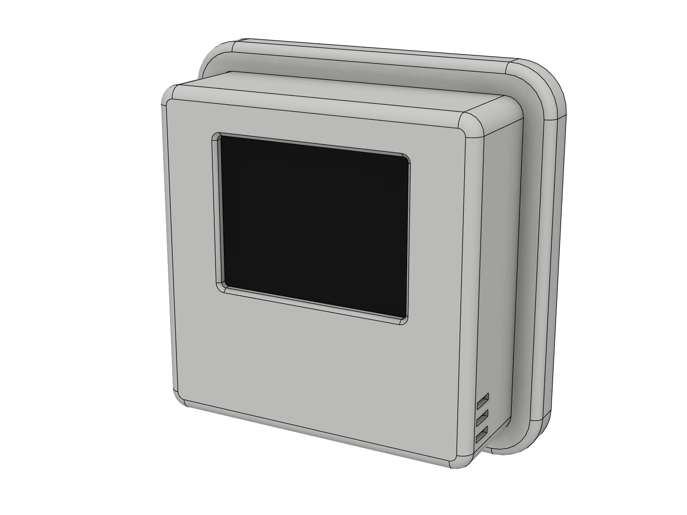
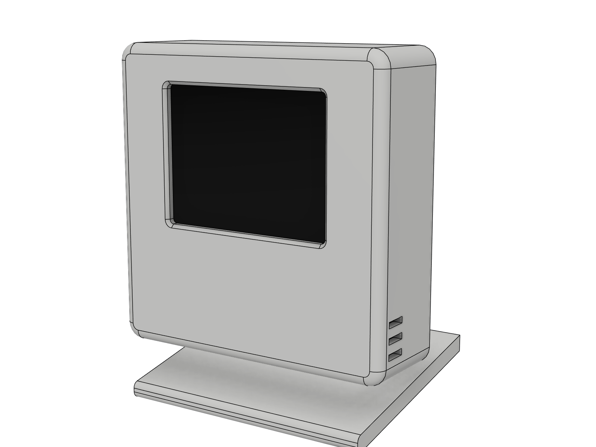
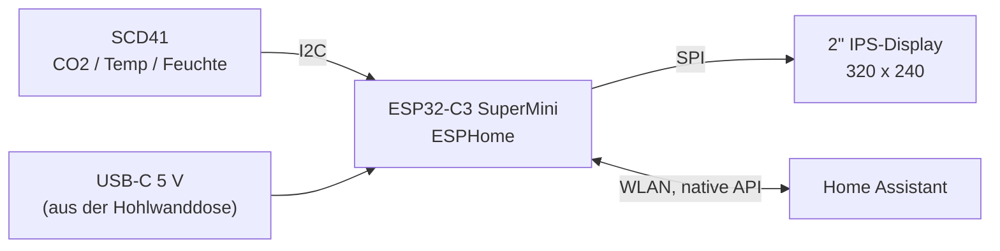
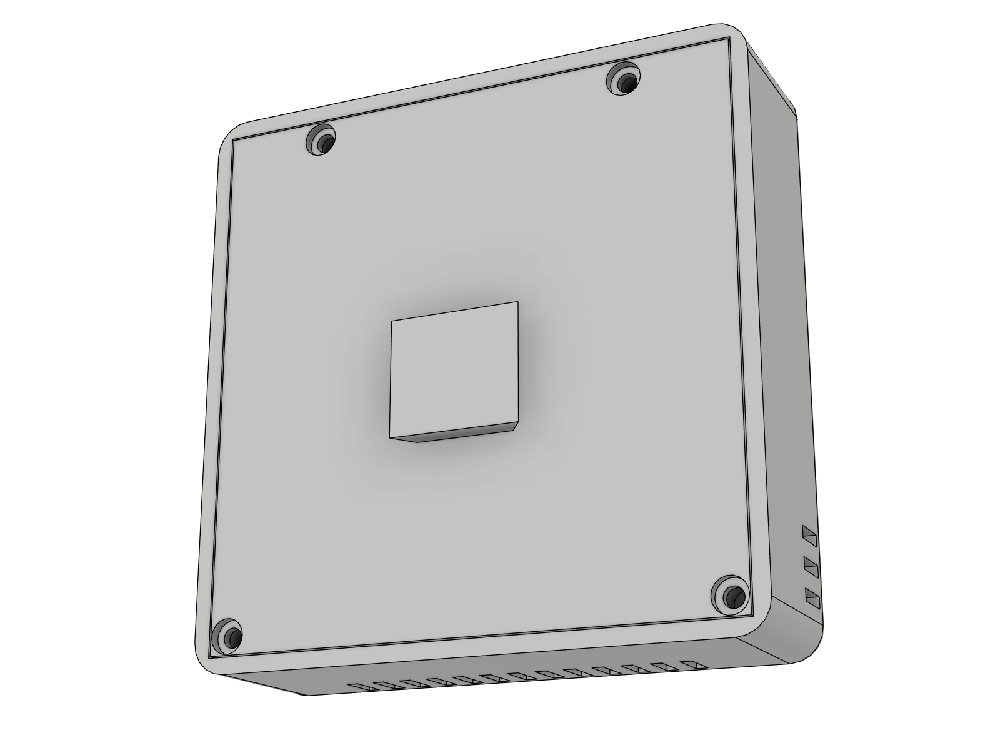

<div align="center">

# CO2-Wandsensor

**Kompakter CO2-, Temperatur- und Feuchtesensor für Home Assistant.<br>
Sitzt unsichtbar auf einer Hohlwanddose oder steht auf dem Schreibtisch.**

[](https://github.com/tobi136B/co2-wall-sensor/actions/workflows/ci.yml)


[English](README.md) | **Deutsch**




</div>

---

## Highlights

* **Echte CO2-Messung** mit dem Sensirion SCD41 (photoakustisch, NDIR), dazu Temperatur und Luftfeuchte.
* **2" IPS-Farbdisplay** mit allem auf einen Blick: Ampelstatus, große CO2-Zahl, 3-Stunden-Verlauf, Uhrzeit, Temperatur und Luftfeuchte. Kein Umschalten, keine Tasten.
* **Ein Gerät, zwei Montagearten.** Eine Schwalbenschwanzschiene auf der Rückseite passt auf die **Wandplatte** (verdeckt eine Standard-Hohlwanddose Ø 68 mm, das Kabel kommt aus der Wand) oder auf den **Tischständer**.
* **Durchdachte Thermik.** Der Sensor sitzt in einer eigenen Kammer, durch einen verschraubten Sensorträger und eine Trennwand vom ESP32 getrennt. Frischluft kommt von unten, die Front bleibt geschlossen und staubunempfindlich.
* **Eine Schraubensorte, überall Metallgewinde.** 10 Einschmelzmuttern M2 × 3 und 10 Linsenkopfschrauben M2 × 4 (ISO 7380) halten Display, Sensorträger und Rückdeckel. Keine Kunststoffgewinde, keine Clips, die ausleiern.
* **Kabel von unten oder hinten, Entscheidung nach dem Druck.** Zwei unsichtbare Ausbrechfelder: hinten für einen Winkelstecker in die Dose oder den Tischständer, unten für einen geraden Stecker.
* **Native Home-Assistant-Integration** über ESPHome: Schwellen, Nachtmodus, Helligkeit und Kalibrierung direkt aus HA bedienbar.
* **Vollständig parametrisches CAD.** Das Gehäuse entsteht per Python-Skript in Autodesk Fusion. Wert ändern, Skript starten, fertig. Technische Zeichnung und Verdrahtungsplan werden aus denselben Quellen erzeugt.
* **Zweisprachig.** Firmware, Doku und Zeichnungen auf Englisch und Deutsch.

<div align="center">

<br><sub>Displaylayout in den drei Stufen (Vorschau erzeugt mit <code>tools/display_preview.py</code>)</sub>
</div>

## Funktionsweise



Alle 30 Sekunden liefert der SCD41 einen neuen Messwert. Der ESP32-C3 aktualisiert das Display, bewertet die Luftqualität anhand zweier Schwellen (Standard 1000 und 1400 ppm) und meldet alles an Home Assistant.

## Technische Daten

| | |
|---|---|
| Gerät | 69,8 × 69,8 × 22 mm (+ 3 mm Schiene) |
| Wandplatte | 82 × 82 × 7 mm, passt auf Hohlwanddosen Ø 68 mm mit 60 mm Schraubabstand |
| Displayfenster | 41,8 × 31,6 mm, 320 × 240 px IPS |
| Sensor | Sensirion SCD41, 400 bis 5000 ppm, ±(50 ppm + 5 % vom Messwert) |
| Versorgung | 5 V über USB-C, ca. 0,5 W |
| Neigung auf dem Tischständer | 12° nach hinten |
| Verbindungselemente | 10 × Einschmelzmutter M2 × 3 (AD 3,2), 10 × M2 × 4 ISO 7380 |
| Kabelaustritt | hinten (Winkelstecker) oder unten (gerader Stecker), Ausbrechfelder |
| Druckmaterial | PETG (PLA möglich), ca. 100 g |

Technische Zeichnung (A3, ISO Methode 1): [Deutsch (PDF)](docs/drawing/co2_wall_sensor_drawing_de.pdf) | [Englisch (PDF)](docs/drawing/co2_wall_sensor_drawing_en.pdf)

<div align="center">


</div>

## Stückliste

| Anz. | Teil | Hinweis | ca. |
|----:|------|---------|----:|
| 1 | Sensirion **SCD41** Modul | CO2, Temperatur, Feuchte, I2C | 20 bis 35 € |
| 1 | **ESP32-C3 SuperMini** | USB-C, WLAN | 3 € |
| 1 | **Waveshare 2inch LCD Module** | ST7789V, 240 × 320, IPS, SPI | 10 € |
| 1 | USB-C-Kabel | **Winkelstecker** für Austritt hinten (Dose, Tischständer) oder **gerader Stecker** für Austritt unten | 5 € |
| 1 | Netzteil 5 V / 1 A | oder Unterputz-USB-Einsatz in der Dose | 5 € |
| 10 | Einschmelzmutter **M2 × 3**, Außendurchmesser 3,2 mm | Display 4, Rückdeckel 4, Sensorträger 2 | 3 € je 100 |
| 10 | Linsenkopfschraube (Halbrundkopf) **M2 × 4**, ISO 7380 | gleiche Stellen, einzige Schraubensorte | 3 € je 100 |
| | Litze AWG 28 bis 30, doppelseitiges Schaumklebeband | Verdrahtung, SCD41 und ESP32-C3 fixieren | |

Maschinenlesbar: [`hardware/bom.csv`](hardware/bom.csv)

## Schnellstart

1. **Drucken:** die fünf Teile aus [`cad/stl`](cad/stl) (Gehäuse, Sensorträger, Rückdeckel, Wandplatte, Tischständer). Druckeinstellungen: [docs/de/aufbau.md](docs/de/aufbau.md).
2. **Verdrahten:** nach [docs/de/verdrahtung.md](docs/de/verdrahtung.md).

   

3. **Flashen:** `esphome/secrets.yaml.example` nach `secrets.yaml` kopieren, ausfüllen und [`esphome/co2-wall-sensor-de.yaml`](esphome/co2-wall-sensor-de.yaml) im ESPHome Builder installieren. Testdateien für einen schnellen Hardwarecheck hängen an jedem [Release](https://github.com/tobi136B/co2-wall-sensor/releases) (siehe [FAQ](docs/de/faq.md)).
4. **Home Assistant** findet das Gerät automatisch. Beispiel-Automationen und eine Dashboard-Karte liegen in [`homeassistant/de`](homeassistant/de).

<div align="center">

<br><sub>Explosionsansicht: Display, Gehäuse, SCD41, Sensorträger, ESP32-C3, Rückdeckel mit Schiene, Wandplatte</sub>
<br><br>


<br><sub>Links: Innenansicht, die USB-C-Buchse zeigt nach unten zu beiden Ausbrechfeldern. Rechts: Rückdeckel mit vier versenkten M2-Schrauben und der Schwalbenschwanzschiene.</sub>
</div>

## Entitäten in Home Assistant

| Entität | Typ | Zweck |
|---------|-----|-------|
| CO2, Temperatur, Luftfeuchtigkeit | Sensor | Messwerte alle 30 s |
| Luftqualität | Text | Gut, Mäßig, Lüften! |
| CO2 Schwelle Gelb / Rot | Zahl | Ampelgrenzen (Standard 1000 / 1400 ppm) |
| Display Helligkeit | Licht | dimmen oder ausschalten |
| Nachtmodus (22 bis 6 Uhr dimmen) | Schalter | automatisches Dimmen in der Nacht |
| SCD41 kalibrieren (Frischluft 420 ppm) | Taste | Zwangskalibrierung an der frischen Luft |
| WLAN Signal, Laufzeit, Neustart | Diagnose | |

## Projektstruktur

```text
co2-wall-sensor/
├── cad/
│   ├── fusion/generate_enclosure/   Fusion-Skript, einzige Quelle für die gesamte Geometrie
│   ├── fusion/co2_wall_sensor.f3d   Fusion-Archiv der Baugruppe
│   ├── step/                        STEP der kompletten Baugruppe
│   └── stl/                         Druckdateien
├── docs/                            Aufbau, Verdrahtung, Designnotizen, FAQ (Deutsch in docs/de)
│   ├── drawing/                     technische Zeichnung, PDF + PNG, EN und DE
│   └── images/                      Renderings, Verdrahtungsplan, Displayvorschau
├── esphome/
│   ├── co2-wall-sensor.yaml         Gerätedatei, englische Oberfläche
│   ├── co2-wall-sensor-de.yaml      Gerätedatei, deutsche Oberfläche
│   └── common/base.yaml             gemeinsame Firmware-Logik
├── hardware/bom.csv                 Stückliste
├── homeassistant/                   Automationen und Dashboard-Karte (Deutsch in homeassistant/de)
└── tools/                           Generatoren für Zeichnung, Verdrahtungsplan und Displayvorschau
```

## Gehäuse anpassen

Alle Maße stehen am Anfang von [`generate_enclosure.py`](cad/fusion/generate_enclosure/generate_enclosure.py) im Block `PARAMETERS`.

1. In Fusion *Dienstprogramme > Skripte und Zusatzmodule* öffnen, mit **+** den Ordner `cad/fusion/generate_enclosure` hinzufügen.
2. Werte anpassen, zum Beispiel `SCD_W`, `SCD_H`, `SCD_T` für eine andere Sensorplatine, und das Skript ausführen.
3. Das Skript baut alle Teile neu und prüft Wand- und Tischaufbau automatisch auf Kollisionen. Mit `EXPORT = True` schreibt es neue STL- und STEP-Dateien.
4. Zeichnung, Verdrahtungsplan und Displayvorschau neu erzeugen:

```bash
pip install -r requirements.txt
python tools/drawing.py
python tools/wiring.py
python tools/display_preview.py
```

Mehr Hintergrund: [Designnotizen](docs/de/design.md) und [FAQ](docs/de/faq.md).

## Vor dem ersten Druck

* **SCD41-Platine:** Im Modell steckt ein Platzhalter mit 20 × 20 × 8,1 mm. Eigene Platine nachmessen und `SCD_W/SCD_H/SCD_T` anpassen.
* **Displayglas:** Waveshare dokumentiert die Glasdicke nicht, angenommen sind 2,5 mm (`GLASS_T`).
* **Firmware:** Die Konfiguration wird von der CI geprüft und kompiliert. Das Displaylayout ist noch nicht auf echter Hardware getestet, Rückmeldungen sind willkommen.

## Ausblick

* [ ] Displaylayout und Thermik auf echter Hardware prüfen
* [ ] Optionaler Helligkeitssensor für automatische Displayhelligkeit
* [ ] Optionaler Drucksensor (BMP280) für die CO2-Druckkompensation in Echtzeit
* [ ] Druckbarer Lichtleiter für eine Variante mit Status-LED

## Mitmachen

Issues und Pull Requests sind willkommen, siehe [CONTRIBUTING.md](CONTRIBUTING.md).

## Lizenz

[MIT](LICENSE) © Tobias Schneider. Nachbauen, anpassen, teilen.
