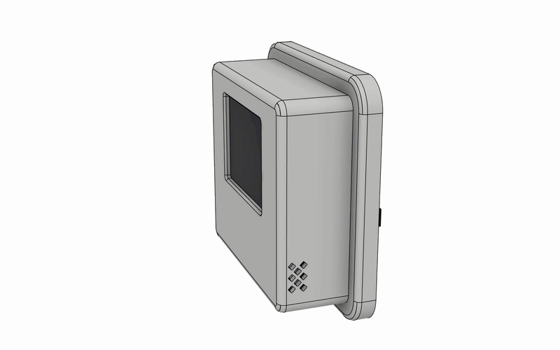
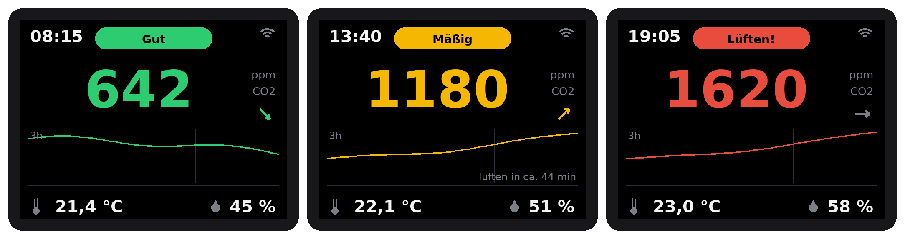
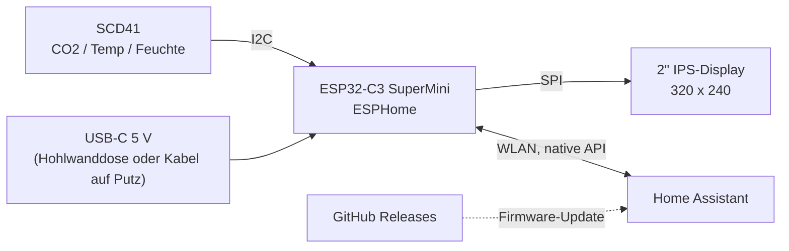
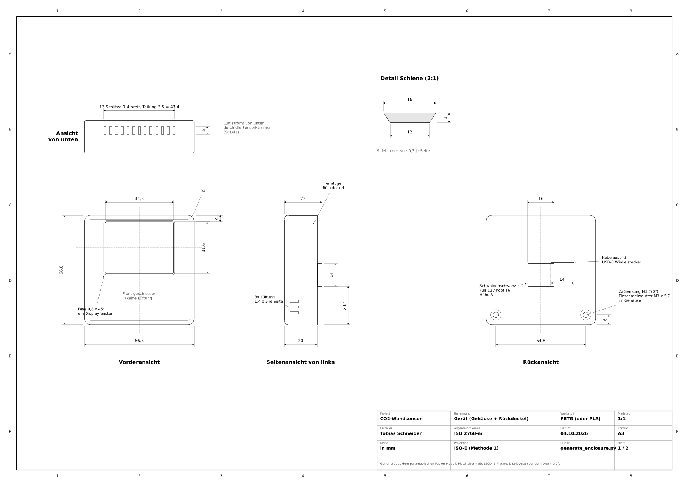
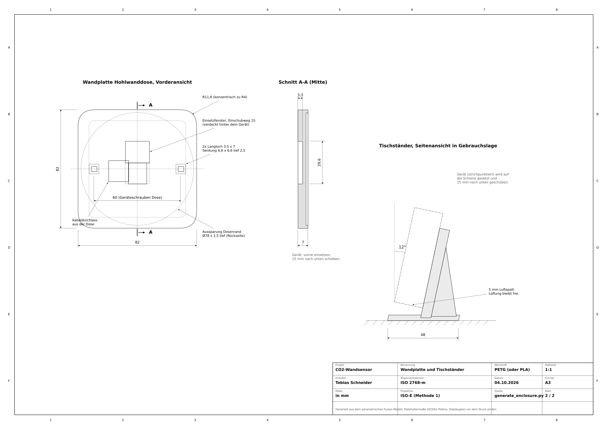
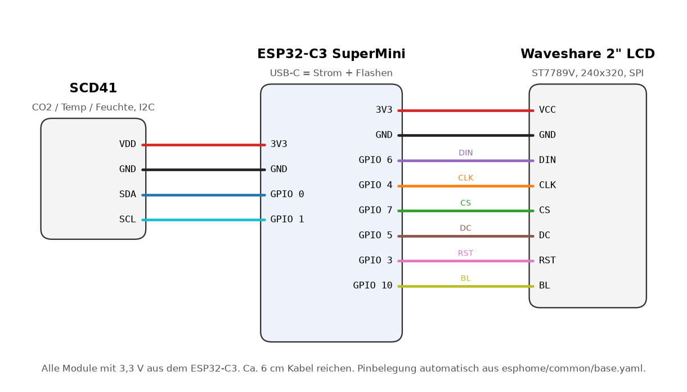
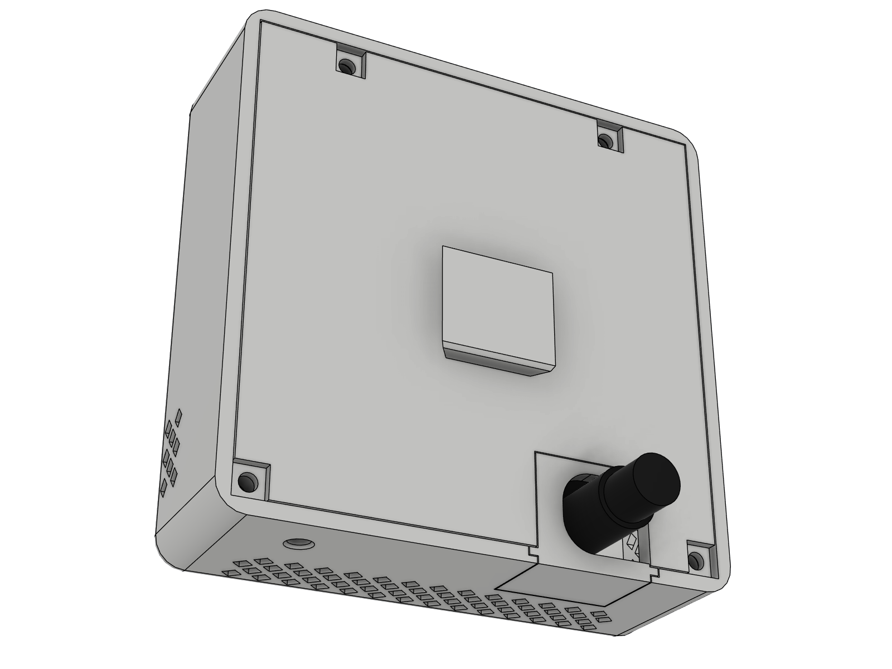
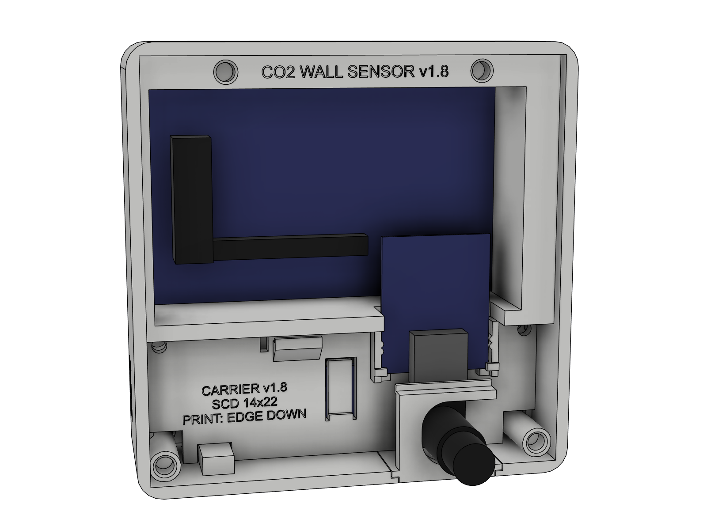
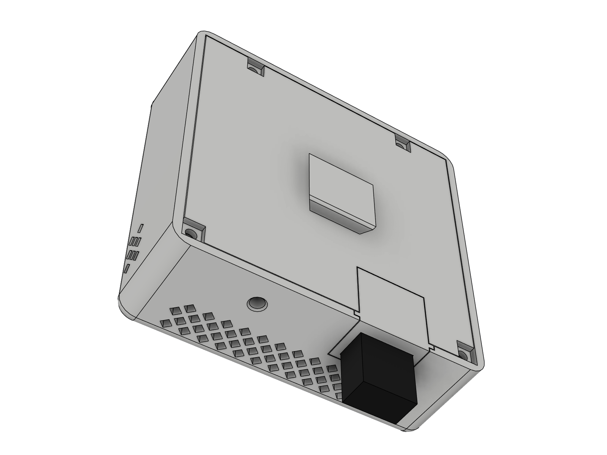

<div align="center">

# CO2-Wandsensor

**Kompakter CO2-, Temperatur- und Feuchtesensor für Home Assistant.<br>
Er verdeckt eine Hohlwanddose oder steht auf dem Schreibtisch.**

[](https://github.com/tobi136B/co2-wall-sensor/actions/workflows/ci.yml)
[](https://github.com/tobi136B/co2-wall-sensor/releases/latest)


[](LICENSE)
[](LICENSE-HARDWARE)

[English](README.md) | **Deutsch** | [Projektseite und Browser-Installer](https://tobi136b.github.io/co2-wall-sensor/de/)



</div>

---

## Highlights

* **Im Browser flashen.** ESP32-C3 per USB anschließen, auf der [Projektseite](https://tobi136b.github.io/co2-wall-sensor/de/) auf *Installieren* klicken, WLAN eintragen. Home Assistant findet das Gerät und bietet neue Versionen als Firmware-Update an.
* **Echte CO2-Messung** mit dem Sensirion SCD41 (photoakustisch, NDIR), dazu Temperatur und Luftfeuchte.
* **2" IPS-Farbdisplay** mit allem auf einen Blick: Ampelstatus, große CO2-Zahl, 3-Stunden-Verlauf, Uhrzeit, Temperatur und Luftfeuchte.
* **Ein Gerät, zwei Montagearten.** Eine Schwalbenschwanzschiene gleitet auf die **Wandplatte** (verdeckt eine Standard-Hohlwanddose Ø 68 mm) oder den **Tischständer**. Eine optionale Sicherungslasche schraubt es an der Wand fest.
* **Kabel von hinten oder unten**, entschieden nach dem Druck mit einem kleinen, tauschbaren **Kabelport-Modul**, das gleichzeitig als Zugentlastung dient.
* **Eine Schraubensorte, nichts geklebt.** 10 Einschmelzmuttern M2 × 3 und 10 Linsenkopfschrauben M2 × 4. Der SCD41 gleitet in Schienen, der ESP32-C3 sitzt in Führungen.
* **Durchdachte Thermik.** Der Sensor sitzt in einer eigenen Kammer unterhalb der Elektronik, Frischluft kommt von unten, die Front bleibt geschlossen.
* **Vollständig parametrisches CAD.** Jedes Maß ist ein Fusion-Benutzerparameter. Wert ändern, Skript starten, neue STL, STEP, Druckplatten und Zeichnung.
* **Zweisprachig.** Firmware, Doku, Zeichnungen und Projektseite auf Englisch und Deutsch.

<div align="center">

<br><sub>Displaylayout in den drei Stufen (Vorschau erzeugt mit <code>tools/display_preview.py</code>)</sub>
</div>

## Funktionsweise



Alle 30 Sekunden liefert der SCD41 einen neuen Messwert. Der ESP32-C3 aktualisiert das Display, bewertet die Luftqualität anhand zweier Schwellen (Standard 1000 und 1400 ppm) und meldet alles an Home Assistant.

## Technische Daten

| | |
|---|---|
| Gerät | 69,8 × 69,8 × 24 mm (+ 3 mm Schiene) |
| Wandplatte | 82 × 82 × 7 mm, passt auf Hohlwanddosen Ø 68 mm mit 60 mm Schraubabstand |
| Displayfenster | 41,8 × 31,6 mm, 320 × 240 px IPS |
| Sensor | Sensirion SCD41, 400 bis 5000 ppm, ±(50 ppm + 5 % vom Messwert) |
| Raumgröße | ein Sensor pro Raum; in offenen Räumen bis etwa 500 m² ([FAQ](docs/de/faq.md#wie-groß-darf-der-raum-für-einen-sensor-sein)) |
| Versorgung | 5 V über USB-C, ca. 0,5 W |
| Kabelaustritt | hinten (Winkelstecker) oder unten (gerader Stecker), tauschbares Port-Modul |
| Verbindungselemente | 10 Einschmelzmuttern M2 × 3 (AD 3,2), 10 Schrauben M2 × 4 ISO 7380 (+ je 2 für die Sicherungslasche) |
| Druckmaterial | PETG (PLA möglich), ca. 110 g |

Technische Zeichnung (A3, ISO Methode 1): [Deutsch (PDF)](docs/drawing/co2_wall_sensor_drawing_de.pdf) | [Englisch (PDF)](docs/drawing/co2_wall_sensor_drawing_en.pdf)

<div align="center">


</div>

## Stückliste

Insgesamt rund 45 €. Die Links sind Vorschläge, Stand Oktober 2026; Preise ändern sich oft.

<!-- bom:start (generated from hardware/bom.yaml) -->
| Anz. | Teil | AliExpress | Amazon.de |
|----:|------|-----------:|----------:|
| 1 | Sensirion **SCD41** Platine, **13,5 × 21,75 mm** oder **15 × 20 mm** ² | [20,99 €](https://de.aliexpress.com/item/1005009740863220.html) |  |
| 1 | **ESP32-C3 SuperMini** | [2,79 €](https://de.aliexpress.com/item/1005007479144456.html) | [8,99 € (2 Stk.)](https://www.amazon.de/dp/B0DMNBWTFD) |
| 1 | **Waveshare 2inch LCD Module** (ST7789V, 240 × 320) | [12,39 €](https://de.aliexpress.com/item/1005008772378337.html) | [16,31 €](https://www.amazon.de/dp/B081Q79X2F) |
| 10 | Einschmelzmutter **M2 × 3**, Außendurchmesser 3,2 mm (Variante "M2 (OD3.2)", Länge 3 mm) | [Link](https://de.aliexpress.com/item/1005008575446687.html) | [6,99 € (200 Stk., AD 3,0)](https://www.amazon.de/dp/B0DZHK4JRC) ¹ |
| 10 | Linsenkopfschraube (Halbrundkopf) **M2 × 4**, ISO 7380 |  | [4,30 € (50 Stk.)](https://www.amazon.de/dp/B0DGXPQ7TW) |
| 1 | USB-Kabel mit **USB-C Winkelstecker** (nach oben/unten gewinkelt) für den Port hinten |  | [7,69 €](https://www.amazon.de/dp/B01MSIE2L1) |
| 1 | USB-Netzteil für die Hohlwanddose (Einbau durch eine Elektrofachkraft) oder ein beliebiges USB-Ladegerät |  | [8,99 €](https://www.amazon.de/dp/B0HHF42X68) |
|  | Silikonlitze AWG 30 |  | [15,49 € (8 Farben)](https://www.amazon.de/dp/B0DH2FBWH7) |
<!-- bom:end -->

¹ Bei Muttern mit 3,0 mm Außendurchmesser den Fusion-Parameter `INSERT_HOLE_D` auf 2,8 setzen.
² Shops zeigen oft eine andere Platine als die, die geliefert wird. Nach dem Auspacken nachmessen und den passenden Träger drucken.
SCD41-Platinen gibt es in verschiedenen Größen. Nur der kleine Sensorträger hängt von der Platine ab: Es gibt einen für die **13,5 × 21,75 mm** und einen für die **15 × 20 mm** Platine, für andere reichen sechs Messwerte. Siehe [Sensor ausmessen](docs/de/sensor-ausmessen.md).
Maschinenlesbar: [`hardware/bom.yaml`](hardware/bom.yaml). Teile, Preise und Shop-Links stehen nur in dieser Datei; die Tabelle oben und die Projektseite werden daraus erzeugt.

## Schnellstart

1. **Drucken:** die beiden fertigen Druckplatten [`co2_wall_sensor_device.3mf`](cad/3mf/co2_wall_sensor_device.3mf) und [`co2_wall_sensor_mounts.3mf`](cad/3mf/co2_wall_sensor_mounts.3mf) (alle Teile schon in Drucklage) oder die einzelnen Dateien aus [`cad/stl`](cad/stl). Einstellungen: [docs/de/aufbau.md](docs/de/aufbau.md).
2. **Verdrahten** nach [docs/de/verdrahtung.md](docs/de/verdrahtung.md) und **zusammenbauen** nach [docs/de/aufbau.md](docs/de/aufbau.md).

   

3. **Flashen** direkt aus dem Browser auf der [Projektseite](https://tobi136b.github.io/co2-wall-sensor/de/). Selbst bauen: `esphome/secrets.yaml.example` nach `secrets.yaml` kopieren, ausfüllen und [`esphome/co2-wall-sensor-de.yaml`](esphome/co2-wall-sensor-de.yaml) im ESPHome Builder installieren.
4. **Home Assistant** findet das Gerät automatisch.

<div align="center">



<br><sub>Kabel nach hinten, Innenansicht, Kabel nach unten</sub>
</div>

## Home Assistant

| Entität | Typ | Zweck |
|---------|-----|-------|
| CO2, Temperatur, Luftfeuchtigkeit | Sensor | Messwerte alle 30 s |
| Luftqualität | Text | Gut, Mäßig, Lüften! |
| CO2 Schwelle Gelb / Rot | Zahl | Ampelgrenzen (Standard 1000 / 1400 ppm) |
| Display Helligkeit | Licht | dimmen oder ausschalten |
| Nachtmodus (22 bis 6 Uhr dimmen) | Schalter | automatisches Dimmen in der Nacht |
| SCD41 kalibrieren (Frischluft 420 ppm) | Taste | Zwangskalibrierung an der frischen Luft |
| Firmware | Update | neue Versionen (Firmware des Browser-Installers) |
| WLAN Signal, Laufzeit, Neustart | Diagnose | |

**Lüftungserinnerung:** Ein fertiger Blueprint schickt eine Nachricht aufs Handy, wenn der CO2-Wert hoch bleibt, und noch einmal, wenn die Luft wieder gut ist.

[](https://my.home-assistant.io/redirect/blueprint_import/?blueprint_url=https%3A%2F%2Fgithub.com%2Ftobi136B%2Fco2-wall-sensor%2Fblob%2Fmain%2Fhomeassistant%2Fblueprints%2Fco2_ventilation_reminder.yaml)

Weitere Beispiele (Automationen, Dashboard-Karte) liegen in [`homeassistant/de`](homeassistant/de).

## Projektstruktur

```text
co2-wall-sensor/
├── cad/
│   ├── fusion/generate_enclosure/   Fusion-Skript, einzige Quelle für die gesamte Geometrie
│   ├── fusion/co2_wall_sensor.f3d   Fusion-Archiv der Baugruppe (mit Schiebegelenk)
│   ├── 3mf/                         druckfertige Platten
│   ├── step/                        STEP der kompletten Baugruppe
│   ├── stl/                         einzelne Druckdateien
│   └── build_info.json              Fingerabdruck der Parameter, aus denen die Druckdateien stammen
├── docs/                            Aufbau, Verdrahtung, Designnotizen, FAQ (Deutsch in docs/de)
│   ├── drawing/                     technische Zeichnung, PDF + PNG, EN und DE
│   └── images/                      Renderings, Animation, Verdrahtungsplan, Displayvorschau
├── esphome/
│   ├── co2-wall-sensor*.yaml        Gerätedateien: eigener Build und Browser-Installer, EN und DE
│   └── common/                      gemeinsame Firmware-Logik und Netzwerk-Varianten
├── hardware/bom.yaml                Stückliste mit Shop-Links
├── homeassistant/                   Blueprint, Automationen und Dashboard-Karte (Deutsch in homeassistant/de)
├── site/                            Vorlage der Projektseite
└── tools/                           Generatoren für Zeichnung, Verdrahtung, Vorschau, Druckplatten, Projektseite, Prüfungen
```

## Gehäuse anpassen

Jedes Maß ist ein **Fusion-Benutzerparameter**.

1. In Fusion *Dienstprogramme > Skripte und Zusatzmodule* öffnen, mit **+** den Ordner `cad/fusion/generate_enclosure` hinzufügen und das Skript einmal ausführen.
2. *Ändern > Parameter ändern* öffnen und Werte anpassen, zum Beispiel `FIT` für strammere oder lockerere Passungen, die `SCD_*`-Werte für eine andere Sensorplatine ([Sensor ausmessen](docs/de/sensor-ausmessen.md)) oder `INSERT_HOLE_D` für andere Einschmelzmuttern.
3. Das Skript erneut starten. Es übernimmt deine Parameter, baut alle Teile neu und prüft Wand- und Tischaufbau auf Kollisionen. Mit `EXPORT = True` schreibt es neue STL- und STEP-Dateien und `cad/build_info.json`.
4. Zeichnung, Druckplatten und die übrigen generierten Dateien neu erzeugen:

```bash
pip install -r requirements.txt
python tools/drawing.py && python tools/build_3mf.py
python tools/wiring.py && python tools/display_preview.py
python tools/check_repo.py
```

Die CI wiederholt all das, kompiliert vier Firmware-Varianten und prüft, ob die Druckdateien zu den eingecheckten Parametern gehören. Mehr Hintergrund: [Designnotizen](docs/de/design.md) und [FAQ](docs/de/faq.md).

## Vor dem ersten Druck

* **SCD41-Platine:** ausmessen und den passenden Sensorträger drucken, siehe [Sensor ausmessen](docs/de/sensor-ausmessen.md).
* **Displayglas:** Waveshare dokumentiert die Glasdicke nicht, angenommen sind 2,5 mm (`GLASS_T`).
* **Stand der Hardware:** Gehäuse und Firmware sind im CAD und in der CI geprüft. Fotos und Messwerte eines gedruckten Geräts sind willkommen.

## Ausblick

* [ ] Sensorträger-Profile für verschiedene SCD41-Platinen ([#7](https://github.com/tobi136B/co2-wall-sensor/issues/7), v1.4)
* [ ] Online-Konfigurator: Sensorträger als STL aus drei Maßen ([#8](https://github.com/tobi136B/co2-wall-sensor/issues/8), v1.5)
* [ ] Displaylayout und Thermik auf echter Hardware prüfen, Fotos ergänzen
* [ ] Optionaler Drucksensor (BMP280) für die CO2-Druckkompensation in Echtzeit
* [ ] Wandplatte für Wände ohne Hohlwanddose

## Mitmachen

Issues, Ideen und Pull Requests sind willkommen, siehe [CONTRIBUTING.md](CONTRIBUTING.md). Fragen und Fotos deines Nachbaus gehören in die [Discussions](https://github.com/tobi136B/co2-wall-sensor/discussions). Sicherheitsprobleme: [SECURITY.md](SECURITY.md).

## Lizenz

Software und Firmware: [MIT](LICENSE). Hardware (Gehäuse, Druckdateien, Zeichnung, Stückliste): [CERN-OHL-P-2.0](LICENSE-HARDWARE). © 2026 Tobias Schneider. Nachbauen, anpassen, teilen.
