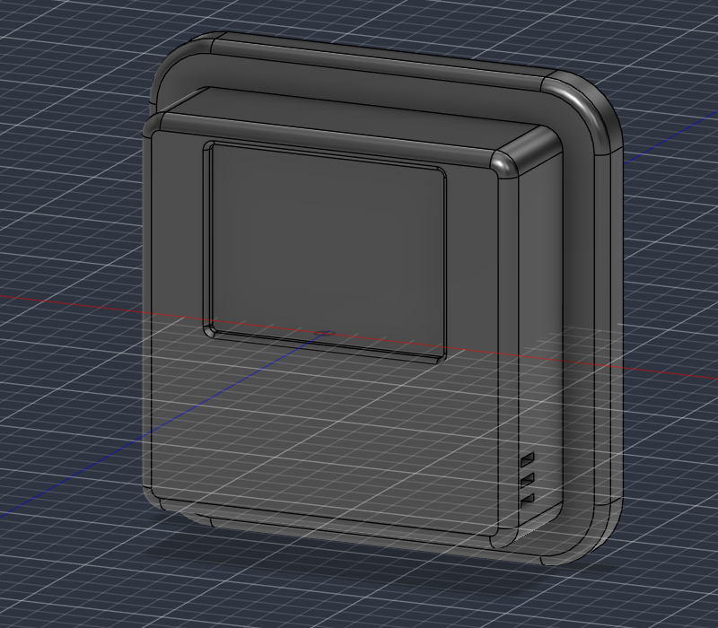
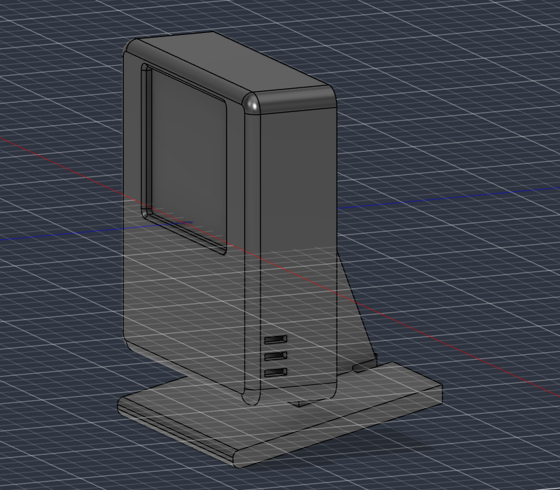
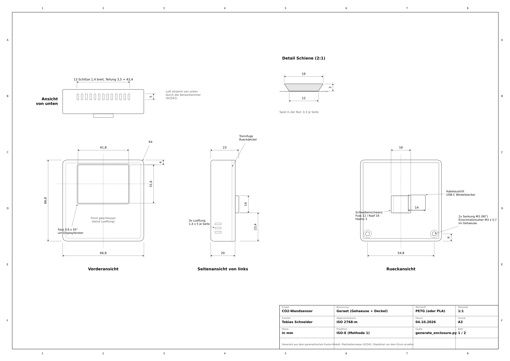
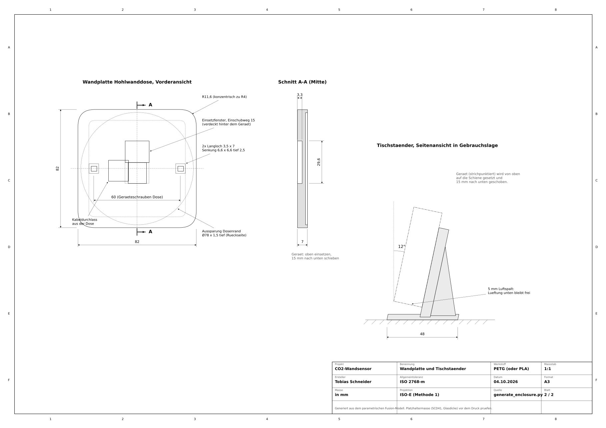

# CO2-Wandsensor für Home Assistant

**Kompakter Luftqualitätssensor mit Farbdisplay, der unsichtbar auf einer Hohlwanddose sitzt oder auf dem Schreibtisch steht.**


<p align="center">
  
  
</p>

## Highlights

* **Echte CO2-Messung** mit dem Sensirion SCD41 (photoakustisch, NDIR-Klasse), dazu Temperatur und Luftfeuchte.
* **2" IPS-Farbdisplay** mit Ampel (Grün, Gelb, Rot), großer CO2-Zahl, 3-Stunden-Verlauf, Uhrzeit, Temperatur und Luftfeuchte. Alles auf einem Bildschirm, kein Umschalten.
* **Zwei Montagearten, ein Gerät:** Schwalbenschwanzschiene hinten. Einfach auf die **Wandplatte** (verdeckt eine Standard-Hohlwanddose, Kabel kommt aus der Wand) oder auf den **Tischständer** schieben.
* **Durchdachte Thermik:** Der Sensor sitzt in einer eigenen Kammer, getrennt vom ESP. Luft strömt von unten nach, die Front bleibt geschlossen und staubunempfindlich.
* **Volle Home-Assistant-Integration:** Ampelschwellen, Nachtmodus, Displayhelligkeit und Kalibrierung direkt aus HA bedienbar.
* **Parametrisches CAD:** Das komplette Gehäuse entsteht per Python-Skript in Autodesk Fusion. Maß ändern, Skript starten, fertig. Zeichnung und Verdrahtungsplan werden ebenfalls aus denselben Daten generiert.

## Abmessungen

| | Maß |
|---|---|
| Gerät | 66,8 × 66,8 × 20 mm (+ 3 mm Schiene) |
| Wandplatte | 82 × 82 × 7 mm, passt auf Hohlwanddosen Ø 68 mm (Schraubabstand 60 mm) |
| Displayfenster | 41,8 × 31,6 mm |
| Neigung auf dem Tischständer | 12° nach hinten |

Technische Zeichnung (A3, ISO Methode 1): [`docs/zeichnung/co2_wandsensor_zeichnung.pdf`](docs/zeichnung/co2_wandsensor_zeichnung.pdf)

<p align="center">
  
  
</p>

## Stückliste

| Anz. | Teil | Hinweis | ca. Preis |
|-----:|------|---------|----------:|
| 1 | Sensirion **SCD41** Modul | CO2, Temperatur, Feuchte (I²C) | 20 bis 35 € |
| 1 | **ESP32-C3 SuperMini** | USB-C, WLAN | 3 € |
| 1 | **Waveshare 2inch LCD Module** | ST7789V, 240 × 320, IPS, SPI | 10 € |
| 1 | USB-C-Kabel mit **90°-Winkelstecker** | gerader Stecker passt nicht | 5 € |
| 1 | USB-Netzteil 5 V / 1 A | oder Unterputz-USB-Einsatz in der Dose | 5 € |
| 2 | Einschmelzmutter **M3** (z. B. Ruthex M3 × 5,7) | Rückdeckel | |
| 2 | Senkkopfschraube **M3 × 6** (ISO 10642) | Rückdeckel | |
| 4 | Kunststoffschraube **M2 × 4** | Display | |
| | Litze AWG 28 bis 30, Schaumklebeband | Verdrahtung, SCD41 fixieren | |
| | PETG Filament, ca. 120 g | alle Druckteile | |

## Schnellstart

1. **Drucken:** STL-Dateien aus [`cad/stl`](cad/stl). Druckhinweise in [`docs/aufbau.md`](docs/aufbau.md).
2. **Verdrahten:** nach [`docs/verdrahtung.md`](docs/verdrahtung.md).

   

3. **Firmware:** `esphome/secrets.yaml.example` nach `secrets.yaml` kopieren, ausfüllen und [`esphome/co2-wandsensor.yaml`](esphome/co2-wandsensor.yaml) im ESPHome Builder flashen.
4. **Home Assistant:** Gerät wird automatisch gefunden. Beispiel-Automationen und eine Dashboard-Karte liegen in [`homeassistant/`](homeassistant).

## Was in Home Assistant ankommt

| Entität | Typ | Zweck |
|---------|-----|-------|
| CO2, Temperatur, Luftfeuchtigkeit | Sensor | Messwerte (alle 30 s) |
| Luftqualität | Text | Gut, Mäßig, Lüften! |
| CO2 Schwelle Gelb / Rot | Zahl | Ampelgrenzen (Standard 1000 / 1400 ppm) |
| Display Helligkeit | Licht | dimmen oder ausschalten |
| Nachtmodus (22 bis 6 Uhr dimmen) | Schalter | automatisches Dimmen |
| SCD41 kalibrieren (Frischluft 420 ppm) | Taste | Zwangskalibrierung an der frischen Luft |
| WLAN Signal, Laufzeit, Neustart | Diagnose | |

## Projektstruktur

```text
co2-wall-sensor/
├── cad/
│   ├── fusion/
│   │   ├── generate_enclosure/      Fusion-Skript (parametrischer Generator)
│   │   └── co2_wall_sensor.f3d      Fusion-Archiv der Baugruppe
│   ├── step/                        STEP der kompletten Baugruppe
│   └── stl/                         Druckdateien
├── docs/
│   ├── aufbau.md                    Druck, Montage, Inbetriebnahme
│   ├── verdrahtung.md               Pinbelegung
│   ├── bilder/                      Renderings und Verdrahtungsplan
│   └── zeichnung/                   technische Zeichnung (PDF + PNG)
├── esphome/
│   ├── co2-wandsensor.yaml          Firmware
│   └── secrets.yaml.example
├── homeassistant/                   Automationen und Dashboard-Karte
└── tools/
    ├── zeichnung.py                 erzeugt die Zeichnung aus den CAD-Parametern
    └── verdrahtung.py               erzeugt den Verdrahtungsplan aus der ESPHome-YAML
```

## Gehäuse anpassen

Alle Maße stehen am Anfang von [`generate_enclosure.py`](cad/fusion/generate_enclosure/generate_enclosure.py) im Block `PARAMETER`:

1. In Fusion: *Dienstprogramme > Skripte und Zusatzmodule*, mit **+** den Ordner `cad/fusion/generate_enclosure` hinzufügen.
2. Werte anpassen (zum Beispiel `SCD_B`, `SCD_H`, `SCD_T` für eine andere Sensorplatine) und das Skript ausführen.
3. Das Skript baut alle Teile neu und prüft dabei automatisch auf Kollisionen.
4. Zeichnung und Verdrahtungsplan neu erzeugen:

```bash
pip install matplotlib pyyaml
python tools/zeichnung.py
python tools/verdrahtung.py
```

## Vor dem ersten Druck prüfen

* **SCD41-Platine:** Im Modell ist ein Platzhalter mit 24 × 22 × 7 mm hinterlegt. Bitte die eigene Platine nachmessen.
* **Displayglas:** Die Glasdicke des Waveshare-Moduls ist nicht dokumentiert, angenommen sind 2,5 mm.

## Lizenz

[MIT](LICENSE). Nachbauen, anpassen und teilen ausdrücklich erwünscht.
