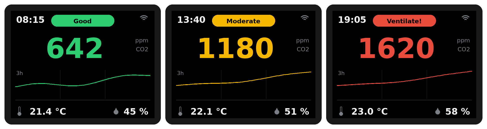
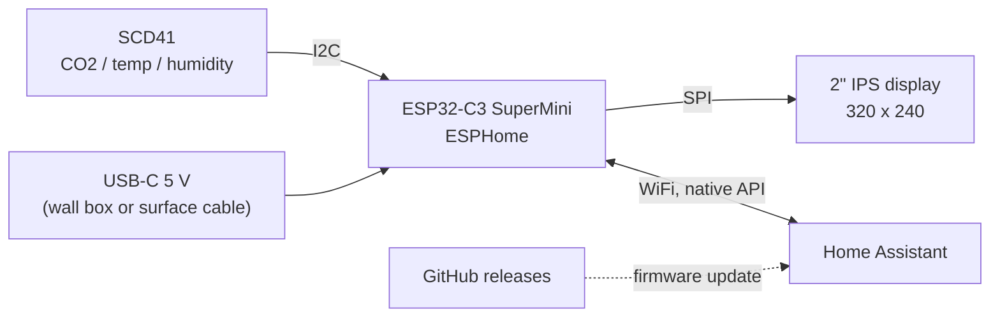
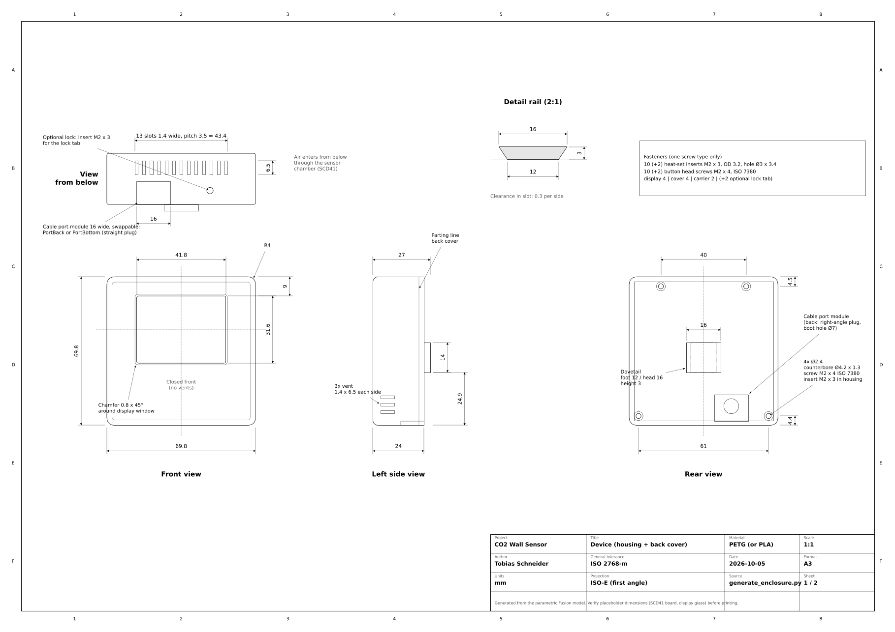
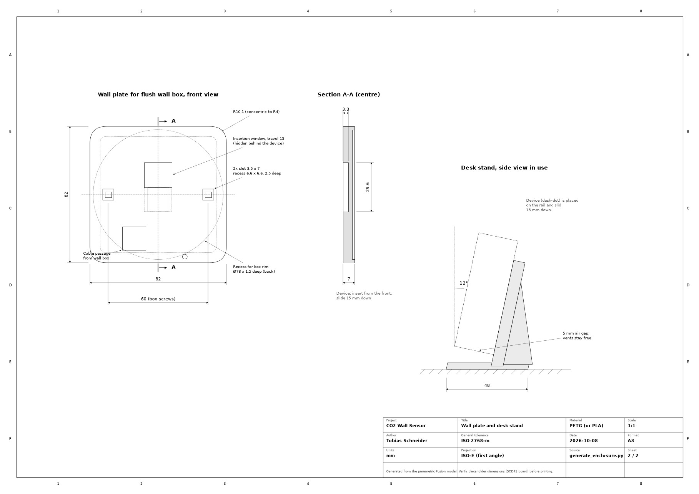

<div align="center">

# CO2 Wall Sensor

**A compact CO2, temperature and humidity monitor for Home Assistant.<br>
It covers a flush wall box or stands on your desk.**

[](https://github.com/tobi136B/co2-wall-sensor/actions/workflows/ci.yml)
[](https://github.com/tobi136B/co2-wall-sensor/releases/latest)


[](LICENSE)
[](LICENSE-HARDWARE)

**English** | [Deutsch](README.de.md) | [Project page and browser installer](https://tobi136b.github.io/co2-wall-sensor/)


</div>

---

## Highlights

* **Flash it from your browser.** Connect the ESP32-C3 via USB, click *Install* on the [project page](https://tobi136b.github.io/co2-wall-sensor/), enter your WiFi. Home Assistant finds the device and offers new releases as a firmware update.
* **Real CO2 measurement** with the Sensirion SCD41 (photoacoustic NDIR), plus temperature and humidity.
* **2" IPS colour display** with everything at a glance: traffic light status, large CO2 value, 3 hour trend, clock, indoor and outdoor temperature and humidity.
* **Window hint.** The display tells you when opening the window cools the room or dries the air, using an outdoor sensor or simply your Home Assistant weather forecast.
* **Everything adjustable in Home Assistant.** Night schedule (dim or off), night brightness, warnings at night, temperature correction, altitude and hint thresholds, no reflashing needed.
* **One device, two mounts.** A dovetail rail slides onto the **wall plate** (covers a standard 68 mm flush wall box) or the **desk stand**. An optional lock tab screws it to the wall.
* **Cable from the back or from below**, decided after printing with a small swappable **cable port module** that doubles as strain relief.
* **One screw type, nothing glued.** 10 heat-set inserts M2 × 3 and 10 button head screws M2 × 4. The SCD41 slides into rails, the ESP32-C3 sits in guides.
* **Thought-through thermals.** The sensor lives in its own chamber below the electronics, fresh air enters from below, the front stays closed.
* **Fully parametric CAD.** Every dimension is a Fusion user parameter. Change a value, run the script, get new STL, STEP, print plates and drawing.
* **Bilingual.** Firmware, documentation, drawings and project page in English and German.

<div align="center">

<br><sub>Display layout in the three states (mock-up generated by <code>tools/display_preview.py</code>)</sub>
</div>

## How it works



Every 30 seconds the SCD41 delivers a new reading. The ESP32-C3 updates the display, classifies the air quality against two thresholds (default 1000 and 1400 ppm) and reports everything to Home Assistant.

## Specifications

| | |
|---|---|
| Device | 69.8 × 69.8 × 24 mm (+ 3 mm rail) |
| Wall plate | 82 × 82 × 7 mm, fits flush wall boxes Ø 68 mm with 60 mm screw spacing |
| Display window | 41.8 × 31.6 mm, 320 × 240 px IPS |
| Sensor | Sensirion SCD41, 400 to 5000 ppm, ±(50 ppm + 5 % of reading) |
| Room size | one sensor per room; in open spaces up to about 500 m² ([FAQ](docs/faq.md#how-large-a-room-can-one-sensor-monitor)) |
| Power | 5 V via USB-C, about 0.5 W |
| Cable exit | back (right-angle plug) or bottom (straight plug), swappable port module |
| Fasteners | 10 heat-set inserts M2 × 3 (OD 3.2), 10 screws M2 × 4 ISO 7380 (+2 each for the lock tab) |
| Print material | PETG (PLA possible), about 110 g |

Technical drawing (A3, ISO first angle): [English PDF](docs/drawing/co2_wall_sensor_drawing_en.pdf) | [German PDF](docs/drawing/co2_wall_sensor_drawing_de.pdf)

<div align="center">


</div>

## Bill of materials

About 55 € for one device (cheapest shop each, without wire and filament). The links are suggestions, checked in October 2026; prices change often.

<!-- bom:start (generated from hardware/bom.yaml) -->
| Qty | Part | AliExpress | Amazon.de |
|----:|------|-----------:|----------:|
| 1 | Sensirion **SCD41** breakout, **13.5 × 21.75 mm** or **15 × 20 mm** ² | [21.19 €](https://de.aliexpress.com/item/1005009740863220.html) | *AliExpress only* |
| 1 | **ESP32-C3 SuperMini** | [2.79 €](https://de.aliexpress.com/item/1005007479144456.html) | [4.30 € (2 pcs: 8.59 €)](https://www.amazon.de/dp/B0HDCHXHMT) |
| 1 | **Waveshare 2inch LCD Module** (ST7789V, 240 × 320) | [12.49 €](https://de.aliexpress.com/item/1005008772378337.html) | [16.31 €](https://www.amazon.de/dp/B081Q79X2F) |
| 10 | Heat-set insert **M2 × 3**, outer diameter 3.0 or 3.2 mm, length 3 mm | [2.39 € (50 pcs, OD 3.2)](https://de.aliexpress.com/item/1005008575446687.html) | [6.99 € (200 pcs, OD 3.0)](https://www.amazon.de/dp/B0DZHK4JRC) |
| 10 | Button head screw **M2 × 4**, ISO 7380 | *Amazon only* | [4.79 € (60 pcs)](https://www.amazon.de/dp/B0FVT11R5L) |
| 1 | USB cable with **right-angle USB-C plug** (angled up/down) for the back port | *Amazon only* | [5.90 € (0.3 m)](https://www.amazon.de/dp/B0DGTQD4Y5) |
| 1 | USB power module for the flush wall box (installation by a qualified electrician), or any USB charger | *Amazon only* | [4.80 € (2 pcs: 9.59 €)](https://www.amazon.de/dp/B0GVWPHKJM) |
|  | Silicone wire AWG 30 | *Amazon only* | [15.49 € (8 colours)](https://www.amazon.de/dp/B0DH2FBWH7) |
<!-- bom:end -->

² Shops often show a different board than the one they send. Measure it on arrival and print the matching carrier.
SCD41 boards come in different sizes. Only the small sensor carrier depends on the board: there is one for the **13.5 × 21.75 mm** and one for the **15 × 20 mm** board, others take six measurements. See [measure your sensor](docs/measure-sensor.md).
Machine-readable: [`hardware/bom.yaml`](hardware/bom.yaml). This file is the only place for parts, prices and shop links; the table above and the project page are generated from it.

## Quick start

1. **Print** the two ready plates [`co2_wall_sensor_device.3mf`](cad/3mf/co2_wall_sensor_device.3mf) and [`co2_wall_sensor_mounts.3mf`](cad/3mf/co2_wall_sensor_mounts.3mf) (every part already in its print orientation, the device plate includes the desk stand: delete it for a wall mount) or the single files from [`cad/stl`](cad/stl). Settings: [docs/assembly.md](docs/assembly.md).
2. **Wire** the modules according to [docs/wiring.md](docs/wiring.md) and **assemble** them as described in [docs/assembly.md](docs/assembly.md). The [3D assembly guide](https://tobi136b.github.io/co2-wall-sensor/assembly.html) shows every step: turn the device, take it apart and see which part comes next.

   

3. **Flash** the firmware from your browser on the [project page](https://tobi136b.github.io/co2-wall-sensor/). To build it yourself: copy `esphome/secrets.yaml.example` to `secrets.yaml`, fill it in and install [`esphome/co2-wall-sensor.yaml`](esphome/co2-wall-sensor.yaml) with the ESPHome Builder (German interface: [`co2-wall-sensor-de.yaml`](esphome/co2-wall-sensor-de.yaml)).
4. **Home Assistant** discovers the device automatically.

<div align="center">


<br><sub>Cable to the back, the interior, cable to the bottom</sub>
</div>

## Home Assistant

| Entity | Type | Purpose |
|--------|------|---------|
| CO2, Temperature, Humidity | sensor | measurements every 30 s |
| CO2 trend, Ventilate in | sensor | ppm per hour, minutes until the red level |
| Air quality | text | Good, Moderate, Ventilate! |
| Outdoor temperature, Outdoor humidity | sensor | from Home Assistant, see [outdoor values](#outdoor-values) |
| Window hint | text | Open the window, Airing dries the air, Keep it shut, None |
| CO2 threshold yellow / red | number | traffic light limits (default 1000 / 1400 ppm) |
| Display brightness | light | dim or switch off the display by hand |
| Night mode, Night from, Night until | switch, time | night schedule (default 22:00 to 06:00) |
| Display at night, Night brightness | select, number | dim (default 8 %) or switch off |
| Red warning at night | switch | the display wakes up while the CO2 level is red |
| Window hint on the display, Outdoor value on the display | switch | show or hide them |
| Window hint from indoor temperature, Window hint: cooler outside by | number | default 24 °C and 3 °C |
| Temperature correction | number | self-heating at your wall: compare with a reference thermometer |
| Altitude above sea level | number | pressure compensation of the CO2 value (default 300 m) |
| Calibrate SCD41 (fresh air 420 ppm) | button | forced recalibration in fresh air |
| Firmware | update | new releases (browser installer firmware) |
| WiFi signal, Uptime, Restart | diagnostic | |

All settings are kept after a power cut. Nothing has to be built yourself: the browser installer firmware has every setting.

### Outdoor values

The display shows the outdoor temperature under **OUT**, and the window hint compares inside and outside.

* **Without anything to set up** the device takes `weather.forecast_home`, the weather entity Home Assistant creates for your home location (integration *Meteorologisk institutt (Met.no)*).
* **A real outdoor sensor wins.** Pair it as usual (Zigbee, Homematic IP, Shelly, ...), open it under *Settings > Devices & services > Entities*, click the gear and set the **entity ID** to `sensor.outdoor_temperature` (humidity: `sensor.outdoor_humidity`). A few seconds later the display shows it. No new firmware needed.

**Ventilation reminder:** a ready blueprint notifies your phone when the CO2 level stays high and again when the air is good.

[](https://my.home-assistant.io/redirect/blueprint_import/?blueprint_url=https%3A%2F%2Fgithub.com%2Ftobi136B%2Fco2-wall-sensor%2Fblob%2Fmain%2Fhomeassistant%2Fblueprints%2Fco2_ventilation_reminder.yaml)

More examples (automations, dashboard card) are in [`homeassistant/`](homeassistant).

## Repository structure

```text
co2-wall-sensor/
├── cad/
│   ├── fusion/generate_enclosure/   Fusion script, the single source of truth for all geometry
│   ├── fusion/co2_wall_sensor.f3d   Fusion archive of the assembly (with slider joint)
│   ├── 3mf/                         print-ready plates
│   ├── step/                        STEP of the full assembly
│   ├── stl/                         single print files
│   └── build_info.json              fingerprint of the parameters the print files were made from
├── docs/                            assembly, wiring, design notes, FAQ (German in docs/de)
│   ├── drawing/                     technical drawing, PDF + PNG, EN and DE
│   └── images/                      renders, animation, wiring diagram, display preview
├── esphome/
│   ├── co2-wall-sensor*.yaml        device files: own build and browser installer, EN and DE
│   └── common/                      shared firmware logic and network variants
├── hardware/bom.yaml                bill of materials with shop links
├── homeassistant/                   blueprint, automations and dashboard card (German in homeassistant/de)
├── site/                            template of the project page
└── tools/                           generators for drawing, wiring, preview, print plates, project page, checks
```

## Customising the enclosure

Every dimension is a **Fusion user parameter**.

1. In Fusion open *Utilities > Scripts and Add-Ins*, click **+** and add the folder `cad/fusion/generate_enclosure`. Run the script once.
2. Open *Modify > Change Parameters* and adjust values, for example `FIT` for tighter or looser fits, the `SCD_*` values for a different sensor board ([measure your sensor](docs/measure-sensor.md)) or `INSERT_HOLE_D` for other inserts.
3. Run the script again. It takes over your parameters, rebuilds every part and checks wall and desk assembly for interference. With `EXPORT = True` it writes new STL and STEP files and `cad/build_info.json`.
4. Regenerate drawing, print plates and the other generated files:

```bash
pip install -r requirements.txt
python tools/drawing.py && python tools/build_3mf.py
python tools/wiring.py && python tools/display_preview.py
python tools/check_repo.py
```

The CI repeats all of this, compiles four firmware variants and checks that the print files belong to the committed parameters. More background: [design notes](docs/design.md) and [FAQ](docs/faq.md).

## Before your first print

* **SCD41 board:** measure it and print the matching sensor carrier, see [measure your sensor](docs/measure-sensor.md).
* **Display glass:** Waveshare does not document the glass thickness, 2.5 mm is assumed (`GLASS_T`).
* **Hardware status:** the enclosure and firmware are verified in CAD and CI. Photos and measurements of a printed device are welcome.

## Roadmap

* [x] Sensor carrier profiles for different SCD41 boards ([#7](https://github.com/tobi136B/co2-wall-sensor/issues/7), v1.4)
* [x] Interactive 3D assembly guide ([open it](https://tobi136b.github.io/co2-wall-sensor/assembly.html), v1.6)
* [x] ESP32-C3 holder from the measured board, tolerant to other batches (v1.7)
* [x] Collision check of every assembly path in the CI (v1.7)
* [ ] Clean cable routing with clips and channels
* [ ] Outdoor temperature on the display, with a hint when opening the window helps
* [ ] Online configurator: sensor carrier STL from three measurements ([#8](https://github.com/tobi136B/co2-wall-sensor/issues/8))
* [ ] Verify display layout and thermals on real hardware, add photos
* [ ] Optional pressure sensor (BMP280) for live CO2 pressure compensation
* [ ] Wall plate variant for walls without a flush box

## Contributing

Issues, ideas and pull requests are welcome, see [CONTRIBUTING.md](CONTRIBUTING.md). Questions and photos of your build go to [Discussions](https://github.com/tobi136B/co2-wall-sensor/discussions). Security issues: [SECURITY.md](SECURITY.md).

## License

Software and firmware: [MIT](LICENSE). Hardware (enclosure, print files, drawing, bill of materials): [CERN-OHL-P-2.0](LICENSE-HARDWARE). © 2026 Tobias Schneider. Build it, adapt it, share it.
