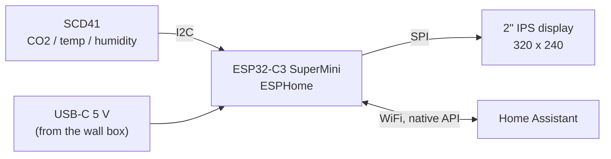

<div align="center">

# CO2 Wall Sensor

**A compact CO2, temperature and humidity monitor for Home Assistant.<br>
Mounts invisibly on a flush wall box or stands on your desk.**

[](https://github.com/tobi136B/co2-wall-sensor/actions/workflows/ci.yml)


**English** | [Deutsch](README.de.md)


</div>

---

## Highlights

* **Real CO2 measurement** with the Sensirion SCD41 (photoacoustic NDIR), plus temperature and humidity.
* **2" IPS colour display** showing everything at a glance: traffic light status, large CO2 value, 3 hour trend, clock, temperature and humidity. No paging, no buttons.
* **One device, two mounts.** A dovetail rail on the back slides onto the **wall plate** (covers a standard 68 mm flush wall box, the cable comes out of the wall) or onto the **desk stand**.
* **Thought-through thermals.** The sensor sits in its own chamber, separated from the ESP32 by a floor and a divider. Fresh air enters from below, the front stays closed and dust resistant.
* **Native Home Assistant integration** via ESPHome: thresholds, night mode, brightness and sensor calibration are all controllable from HA.
* **Fully parametric CAD.** The enclosure is generated by a Python script in Autodesk Fusion. Change a value, run the script, done. The technical drawing and the wiring diagram are generated from the same sources.
* **Bilingual.** Firmware, documentation and drawings in English and German.

<div align="center">

<br><sub>Display layout in the three states (mock-up generated by <code>tools/display_preview.py</code>)</sub>
</div>

## How it works



Every 30 seconds the SCD41 delivers a new reading. The ESP32-C3 updates the display, classifies the air quality against two thresholds (default 1000 and 1400 ppm) and reports everything to Home Assistant.

## Specifications

| | |
|---|---|
| Device | 66.8 × 66.8 × 20 mm (+ 3 mm rail) |
| Wall plate | 82 × 82 × 7 mm, fits flush wall boxes Ø 68 mm with 60 mm screw spacing |
| Display window | 41.8 × 31.6 mm, 320 × 240 px IPS |
| Sensor | Sensirion SCD41, 400 to 5000 ppm, ±(50 ppm + 5 % of reading) |
| Power | 5 V via USB-C, about 0.5 W |
| Desk stand tilt | 12° backwards |
| Print material | PETG (PLA possible), about 120 g |

Technical drawing (A3, ISO first angle): [English PDF](docs/drawing/co2_wall_sensor_drawing_en.pdf) | [German PDF](docs/drawing/co2_wall_sensor_drawing_de.pdf)

<div align="center">


</div>

## Bill of materials

| Qty | Part | Notes | approx. |
|----:|------|-------|--------:|
| 1 | Sensirion **SCD41** breakout | CO2, temperature, humidity, I2C | 20 to 35 € |
| 1 | **ESP32-C3 SuperMini** | USB-C, WiFi | 3 € |
| 1 | **Waveshare 2inch LCD Module** | ST7789V, 240 × 320, IPS, SPI | 10 € |
| 1 | USB-C cable with **right-angle plug** | a straight plug does not fit | 5 € |
| 1 | 5 V / 1 A power supply | or a flush mounted USB insert in the wall box | 5 € |
| 2 | Heat-set insert **M3** (e.g. Ruthex M3 × 5.7) | back cover | |
| 2 | Countersunk screw **M3 × 6** (ISO 10642) | back cover | |
| 4 | Self-tapping plastic screw **M2 × 4** | display | |
| | Wire AWG 28 to 30, foam tape | wiring, fixing the SCD41 | |

Machine-readable: [`hardware/bom.csv`](hardware/bom.csv)

## Quick start

1. **Print** the four parts from [`cad/stl`](cad/stl). Print settings: [docs/assembly.md](docs/assembly.md).
2. **Wire** the modules according to [docs/wiring.md](docs/wiring.md).

   

3. **Flash** the firmware: copy `esphome/secrets.yaml.example` to `secrets.yaml`, fill it in and install [`esphome/co2-wall-sensor.yaml`](esphome/co2-wall-sensor.yaml) with the ESPHome Builder (German interface: [`co2-wall-sensor-de.yaml`](esphome/co2-wall-sensor-de.yaml)). Test binaries for a quick hardware check are attached to every [release](https://github.com/tobi136B/co2-wall-sensor/releases) (see [FAQ](docs/faq.md)).
4. **Home Assistant** discovers the device automatically. Example automations and a dashboard card are in [`homeassistant/`](homeassistant).

<div align="center">

<br><sub>Exploded view: housing, display, SCD41, ESP32-C3, back cover with rail, wall plate</sub>
</div>

## Home Assistant entities

| Entity | Type | Purpose |
|--------|------|---------|
| CO2, Temperature, Humidity | sensor | measurements every 30 s |
| Air quality | text | Good, Moderate, Ventilate! |
| CO2 threshold yellow / red | number | traffic light limits (default 1000 / 1400 ppm) |
| Display brightness | light | dim or switch off the display |
| Night mode (dim 22:00 to 06:00) | switch | automatic dimming at night |
| Calibrate SCD41 (fresh air 420 ppm) | button | forced recalibration in fresh air |
| WiFi signal, Uptime, Restart | diagnostic | |

## Repository structure

```text
co2-wall-sensor/
├── cad/
│   ├── fusion/generate_enclosure/   Fusion script, the single source of truth for all geometry
│   ├── fusion/co2_wall_sensor.f3d   Fusion archive of the assembly
│   ├── step/                        STEP of the full assembly
│   └── stl/                         print files
├── docs/                            assembly, wiring, design notes, FAQ (German in docs/de)
│   ├── drawing/                     technical drawing, PDF + PNG, EN and DE
│   └── images/                      renders, wiring diagram, display preview
├── esphome/
│   ├── co2-wall-sensor.yaml         device file, English interface
│   ├── co2-wall-sensor-de.yaml      device file, German interface
│   └── common/base.yaml             shared firmware logic
├── hardware/bom.csv                 bill of materials
├── homeassistant/                   automations and dashboard card (German in homeassistant/de)
└── tools/                           generators for drawing, wiring diagram and display preview
```

## Customising the enclosure

All dimensions live at the top of [`generate_enclosure.py`](cad/fusion/generate_enclosure/generate_enclosure.py) in the `PARAMETERS` block.

1. In Fusion open *Utilities > Scripts and Add-Ins*, click **+** and add the folder `cad/fusion/generate_enclosure`.
2. Adjust values, for example `SCD_W`, `SCD_H`, `SCD_T` for a different sensor board, and run the script.
3. The script rebuilds every part and checks wall and desk assembly for interference automatically. With `EXPORT = True` it writes fresh STL and STEP files.
4. Regenerate drawing, wiring diagram and display preview:

```bash
pip install -r requirements.txt
python tools/drawing.py
python tools/wiring.py
python tools/display_preview.py
```

More background: [design notes](docs/design.md) and [FAQ](docs/faq.md).

## Before your first print

* **SCD41 board:** the model uses a 24 × 22 × 7 mm placeholder. Measure your board and adjust `SCD_W/SCD_H/SCD_T`.
* **Display glass:** Waveshare does not document the glass thickness, 2.5 mm is assumed (`GLASS_T`).
* **Firmware:** the configuration is validated and compiled by CI. The display layout has not been verified on real hardware yet, feedback is welcome.

## Roadmap

* [ ] Verify display layout and thermals on real hardware
* [ ] Optional ambient light sensor for automatic brightness
* [ ] Optional pressure sensor (BMP280) for live CO2 pressure compensation
* [ ] Printable light pipe for a status LED variant

## Contributing

Issues and pull requests are welcome, see [CONTRIBUTING.md](CONTRIBUTING.md).

## License

[MIT](LICENSE) © Tobias Schneider. Build it, adapt it, share it.
