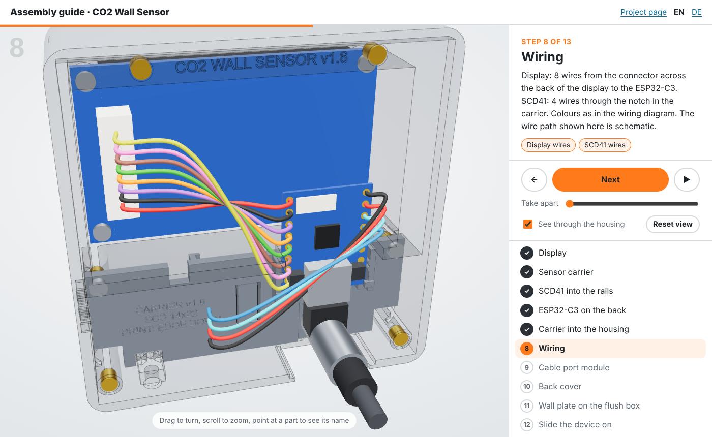
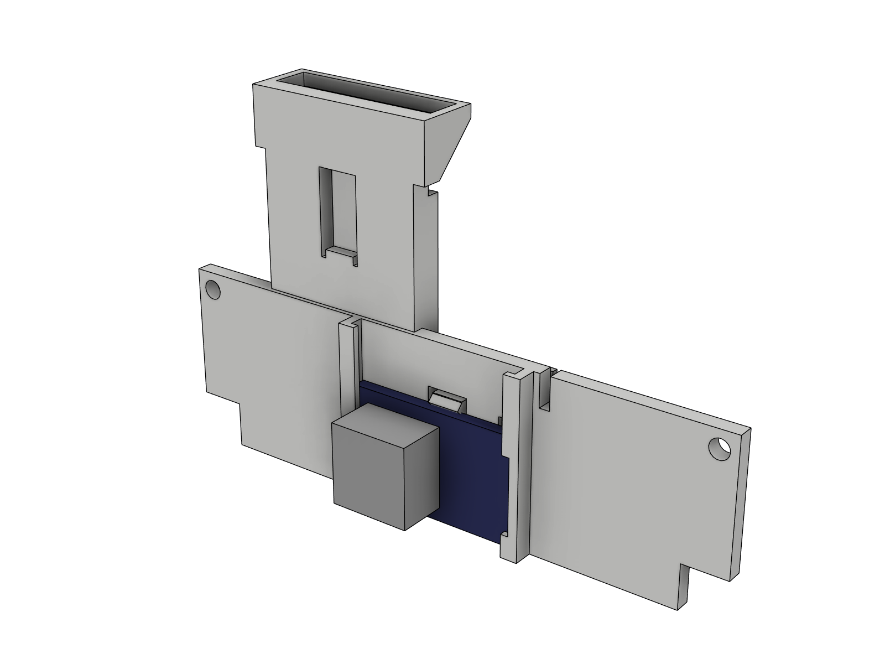
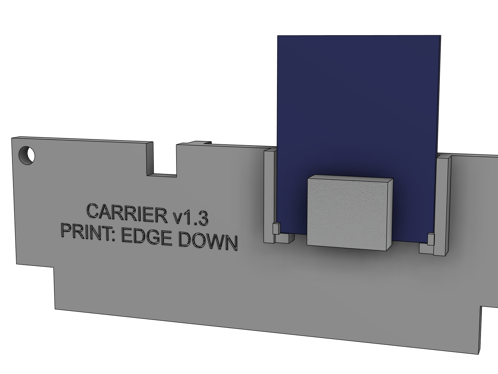
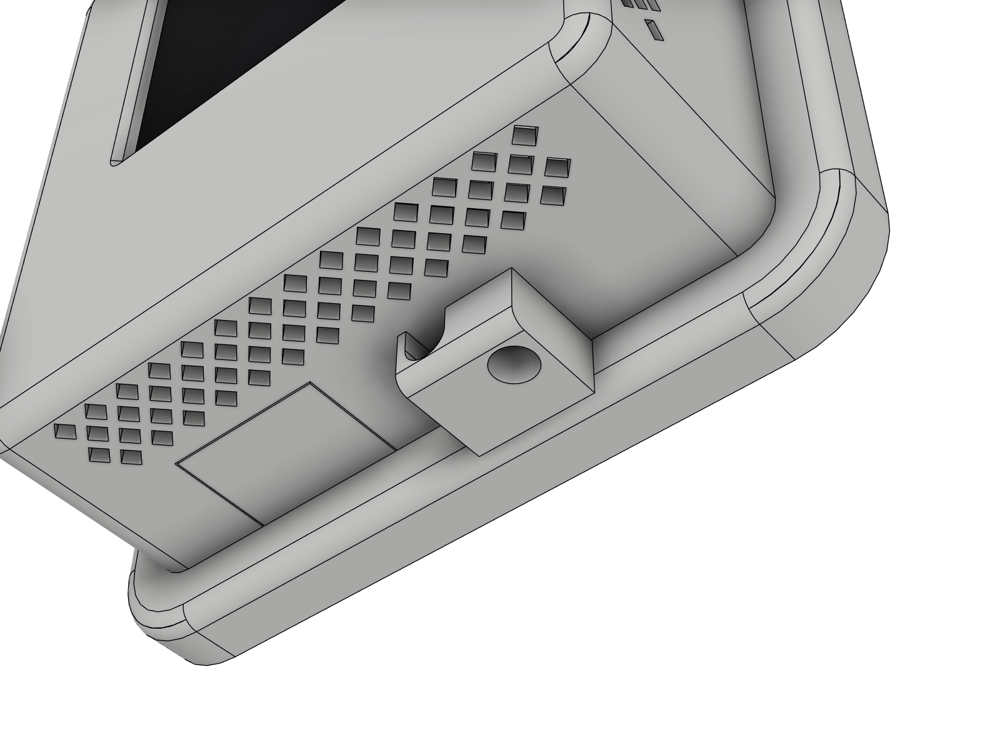

# Printing and assembly

**English** | [Deutsch](de/aufbau.md)

**Prefer it in 3D?** The [interactive assembly guide](https://tobi136b.github.io/co2-wall-sensor/assembly.html) walks through all 13 steps. Turn the device, take it apart with the slider, look through the housing and see which part comes next.

## 1. 3D printing

Every part carries its name, the version and its print orientation as an engraved label on a hidden face.

| Part | File | Orientation | Notes |
|------|------|-------------|-------|
| Housing | [`housing.stl`](../cad/stl/housing.stl) | front face down | The front lies on the bed (a textured PEI sheet looks great). A 45° foot on the front edge prevents elephant foot. No supports. |
| Sensor carrier | [`sensor_carrier_14x22.stl`](../cad/stl/sensor_carrier_14x22.stl) or [`sensor_carrier_15x20.stl`](../cad/stl/sensor_carrier_15x20.stl) | standing on its lower edge | **Matching your SCD41 board**, see [measure your sensor](measure-sensor.md). Printed on edge the rails become vertical channels and the spring tongue grows upwards. Use a 5 mm brim. |
| Back cover | [`back_cover.stl`](../cad/stl/back_cover.stl) | inside face down | Label "THIS FACE DOWN". Rail points up, no supports. |
| Cable port, back | [`cable_port_back.stl`](../cad/stl/cable_port_back.stl) | large back face down | For a right-angle plug. |
| Cable port, bottom | [`cable_port_bottom.stl`](../cad/stl/cable_port_bottom.stl) | large back face down | For a straight plug. Print both ports, they take 2 g each. |
| Wall plate | [`wall_plate.stl`](../cad/stl/wall_plate.stl) | **front face down** | The front gets the bed surface. Printed the other way round, the 78 mm recess for the box rim would have to be bridged. |
| Lock tab (optional) | [`lock_tab.stl`](../cad/stl/lock_tab.stl) | front face down | Only needed if the device should not be removable without a tool. |
| Desk stand | [`desk_stand.stl`](../cad/stl/desk_stand.stl) | on its side | Printed on its side the rail is strongest. |

**Recommended settings:** PETG, 0.2 mm layers, 3 walls, 20 % gyroid infill, seam position "rear" or "aligned". PLA works too but may soften in summer behind a sunny window.

**Two colours:** housing in matte black or anthracite, wall plate in the colour of your light switches (usually pure white). The result looks like a switch insert in its frame.

**Fit too tight or too loose?** All sliding and plugged fits depend on one value, `FIT` (0.3 mm per side). Change it in Fusion under *Modify > Change Parameters*, run the script again and print the affected part. See [design notes](design.md#parameters-in-fusion).

## 2. Fasteners: one screw type for everything

| Qty | Part | Where |
|----:|------|-------|
| 10 | Heat-set insert **M2 × 3**, outer diameter 3.0 or 3.2 mm (hole Ø 2.9 × 3.4 mm fits both) | 4 display, 4 back cover, 2 sensor carrier |
| 10 | Button head screw **M2 × 4**, ISO 7380, hex socket 1.3 mm | same positions |
| +2 | the same insert and screw | optional lock tab: 1 in the housing, 1 in the wall plate |

The only other screws are the two that come with your flush wall box. Nothing in the device is glued.

## 3. Pre-assembly

1. **Press in the inserts** with a soldering iron (about 200 to 220 °C, M2 tip if you have one). Every hole has a small entry chamfer that centres the insert. Let it sink in under its own weight and stop flush.
   * 4 on the display bosses around the display bay. The front skin behind them is only 1.1 mm thick, so work with low temperature and little pressure.
   * 4 for the back cover: 2 in the bottom corners, 2 in the solid band above the display.
   * 2 for the sensor carrier on the short bosses in the chin.
   * Optional lock: 1 from outside into the bottom of the housing, 1 into the front of the wall plate below the device.
2. **Test the electronics on the desk first.** Wire everything as described in [wiring.md](wiring.md), flash the firmware and check the display before building it in.

## 4. Choose the cable exit

The cable leaves through a small, swappable **cable port module** at the lower back edge. Print both versions and decide on site:

| Module | Plug | Use |
|--------|------|-----|
| **Port back** | right-angle USB-C, "up/down angled" | flush wall box and **always on the desk stand** |
| **Port bottom** | straight USB-C, overmould at most 12 × 7 mm | cable on the wall surface, power bank below the device |

 

The module is clamped between housing and back cover. A step in the bottom wall stops it from falling out, a lip under the back cover stops it from leaving towards the back. Changing the cable exit later takes four screws.

**Strain relief:** with the back module the round body of the right-angle plug passes through an oblong hole, its collar sits under the module. A pull on the cable ends at the module, not at the USB socket.

## 5. Assembly

1. **Display:** place it glass first into the display bay. Fix it with 4 × M2 × 4.
2. **SCD41:** solder four wires of about 8 cm to GND, VDD, SCL and SDA. Slide the board **from the top** into the two rails on the front side of the sensor carrier, sensor facing away from the carrier, pads towards the wire notch. Push it down until it stands on the end stops: the hook of the spring tongue clicks over the upper edge and holds the board without play. Lead the wires through the notch at the upper edge. To remove the board, push the tongue back with a small screwdriver.

   
3. **ESP32-C3:** solder the wires to display and SCD41 ([wiring](wiring.md)). Slide the ESP32-C3 from above between the side guides on the back of the carrier until its lower edge rests on the end stops and slips under the two small lips.

   Then plug the USB cable in from below, the carrier is open below the socket:
   * back module: lay the cable into the side slot of the module,
   * bottom module: push the plug through the module from outside first.

   
4. **Sensor carrier:** put it onto the ledges in the chin and fix it with 2 × M2 × 4. It closes the sensor chamber against the warm electronics. Seal the wire notch with a drop of hot glue.
5. **Cable port module:** slide it into the opening at the lower back edge.
6. **Back cover:** put it into the seat and fix it with 4 × M2 × 4. The button heads sit in counterbores below the surface, so the cover still slides onto the wall plate.

## 6. Wall mounting on a flush wall box

1. **Bring power into the box:** either a flush mounted USB power supply (work on 230 V must be done by a qualified electrician) or a USB cable that runs inside the wall to a socket.
2. **Mount the wall plate** with the two box screws (60 mm spacing, horizontal). The slots compensate a slightly rotated box.
3. Route the USB cable through the cable passage and plug it into the device.
4. **Attach the device:** hold it in front of the plate, insert the rail into the hidden insertion window and **slide it 15 mm down**. Done.
5. **Optional lock:** hold the lock tab below the device, screw it up into the housing and back into the wall plate (2 × M2 × 4).

   

To remove the device, take off the lock tab if fitted, push the device 15 mm up and pull it off.

## 7. Desk stand

Use the back module with a right-angle plug. Place the device on the rail from above and slide it down. The device leans back by 12°, a 5 mm air gap below keeps the vents free. The cable runs out through the notch at the back of the foot.

## 8. Commissioning

**The easy way:** flash the firmware from the browser on the [project page](https://tobi136b.github.io/co2-wall-sensor/), enter your WiFi in the same window and adopt the device in Home Assistant. Firmware updates then appear in Home Assistant.

**Build it yourself:**

1. Copy `esphome/secrets.yaml.example` to `esphome/secrets.yaml` and fill it in.
2. Open the ESPHome Builder in Home Assistant and add `esphome/co2-wall-sensor.yaml` (English) or `esphome/co2-wall-sensor-de.yaml` (German) together with the `common` folder.
3. Flash via USB the first time, afterwards updates go over WiFi (OTA).

**After that, in both cases:**

1. **Calibration:** put the device next to an open window for 15 minutes, then press *Calibrate SCD41 (fresh air 420 ppm)* in Home Assistant. Automatic self calibration is enabled in addition.
2. **Temperature:** after 24 hours compare with a reference thermometer and adjust the substitution `temperature_offset` in your device file (after adopting the device in the ESPHome dashboard, if you used the browser installer).
