# Printing and assembly

**English** | [Deutsch](de/aufbau.md)

**Prefer it in 3D?** The [interactive assembly guide](https://tobi136b.github.io/co2-wall-sensor/assembly.html) walks through all 13 steps. Turn the device, take it apart with the slider, look through the housing and see which part comes next.

## 1. 3D printing

Every part carries its name, the version and its print orientation as an engraved label on a hidden face.

| Part | File | Orientation | Notes |
|------|------|-------------|-------|
| Housing | [`housing.stl`](../cad/stl/housing.stl) | front face down | The front lies on the bed (a textured PEI sheet looks great). A 45° foot on the front edge prevents elephant foot. No supports. |
| Sensor carrier | [`sensor_carrier_14x22.stl`](../cad/stl/sensor_carrier_14x22.stl) or [`sensor_carrier_15x20.stl`](../cad/stl/sensor_carrier_15x20.stl) | standing on its lower edge | **Matching your SCD41 board**, see [measure your sensor](measure-sensor.md). Printed on edge the rails become vertical channels and the spring tongue grows upwards. Use a 5 mm brim. |
| Back cover | [`back_cover.stl`](../cad/stl/back_cover.stl) | inside face down | Label "THIS FACE DOWN". Rail points up, no supports. |
| Cable port, back | [`cable_port_back.stl`](../cad/stl/cable_port_back.stl) | large back face down | For a right-angle plug. |
| Cable port, bottom | [`cable_port_bottom.stl`](../cad/stl/cable_port_bottom.stl) | large back face down | For a straight plug. Print both ports, they take 2 g each. |
| Wall plate | [`wall_plate.stl`](../cad/stl/wall_plate.stl) | **front face down** | The front gets the bed surface. Printed the other way round, the 78 mm recess for the box rim would have to be bridged. |
| Lock tab (optional) | [`lock_tab.stl`](../cad/stl/lock_tab.stl) | front face down | Only needed if the device should not be removable without a tool. |
| Desk stand | [`desk_stand.stl`](../cad/stl/desk_stand.stl) | on its side | Printed on its side the rail is strongest. |

**Recommended settings:** PETG, 0.2 mm layers, 3 walls, 20 % gyroid infill, seam position "rear" or "aligned". PLA works too but may soften in summer behind a sunny window.

**Two colours:** housing in matte black or anthracite, wall plate in the colour of your light switches (usually pure white). The result looks like a switch insert in its frame.

**Fit too tight or too loose?** All sliding and plugged fits depend on one value, `FIT` (0.3 mm per side). Change it in Fusion under *Modify > Change Parameters*, run the script again and print the affected part. See [design notes](design.md#parameters-in-fusion).

## 2. Fasteners: one screw type for everything

| Qty | Part | Where |
|----:|------|-------|
| 10 | Heat-set insert **M2 × 3**, outer diameter 3.0 or 3.2 mm (hole Ø 2.9 × 3.4 mm fits both) | 4 display, 4 back cover, 2 sensor carrier |
| 10 | Button head screw **M2 × 4**, ISO 7380, hex socket 1.3 mm | same positions |
| +2 | the same insert and screw | optional lock tab: 1 in the housing, 1 in the wall plate |

The only other screws are the two that come with your flush wall box. Nothing in the device is glued.

## 3. Choose the cable exit

The cable leaves through a small, swappable **cable port module** at the lower back edge. Print both versions and decide on site:

| Module | Plug | Use |
|--------|------|-----|
| **Port back** | right-angle USB-C, "up/down angled" | flush wall box and **always on the desk stand** |
| **Port bottom** | straight USB-C, overmould at most 12 × 7 mm | cable on the wall surface, power bank below the device |

 

The module is clamped between housing and back cover. A step in the bottom wall stops it from falling out, a lip under the back cover stops it from leaving towards the back. Changing the cable exit later takes four screws.

**Strain relief:** with the back module the round body of the right-angle plug passes through an oblong hole, its collar sits under the module. A pull on the cable ends at the module, not at the USB socket.

## 4. Step by step

**Before you start, have at hand:** soldering iron with a fine tip, hex key 1.3 mm, small flat screwdriver, side cutter. All 13 steps are also in the [3D assembly guide](https://tobi136b.github.io/co2-wall-sensor/assembly.html), where you can turn every step and take the device apart.

<!-- steps:start (generated from site/assembly_steps.yaml) -->

### Step 1 of 13: The housing

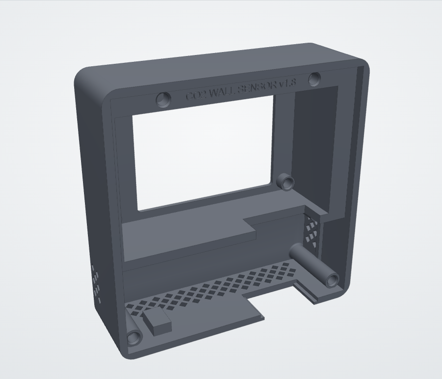

**You need:** Printed housing

Printed front face down. You look at it from the back, the side that later faces the wall. ([see it in 3D](https://tobi136b.github.io/co2-wall-sensor/assembly.html#step-1))

> **Tip:** No supports needed. Remove the brim and check that the four cover seats in the corners are clean.

### Step 2 of 13: 10 heat-set inserts

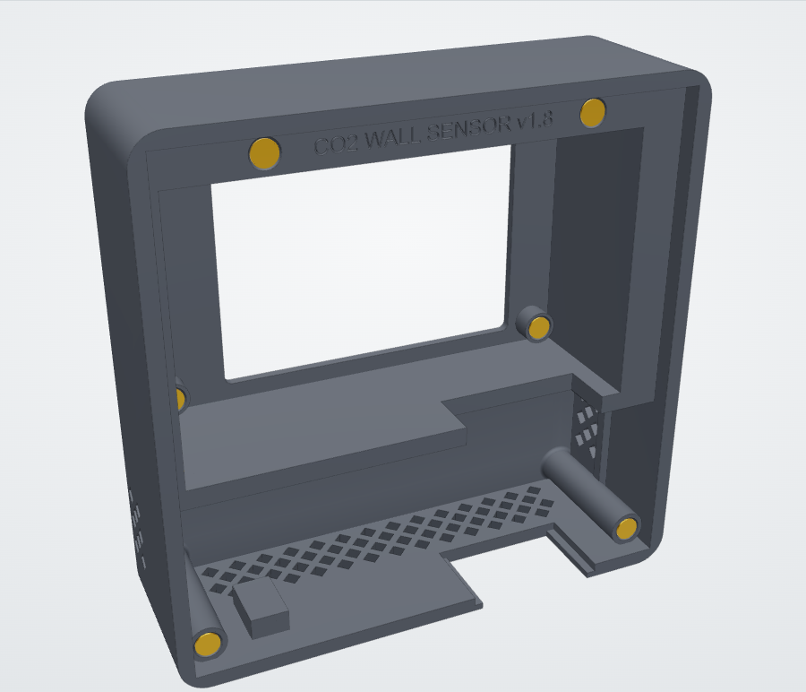

**You need:** 10 heat-set inserts M2 × 3, soldering iron at 200 to 220 °C

Press the M2 inserts in with the soldering iron (about 200 to 220 °C). 4 around the display bay, 4 for the back cover, 2 for the sensor carrier. The entry chamfer centres them. ([see it in 3D](https://tobi136b.github.io/co2-wall-sensor/assembly.html#step-2))

> **Tip:** Set the insert on the hole, touch it with the iron and let it sink under its own weight until it is flush. Do not push. The front behind the 4 display domes is only 1.1 mm thick: little heat, no pressure.

### Step 3 of 13: Display

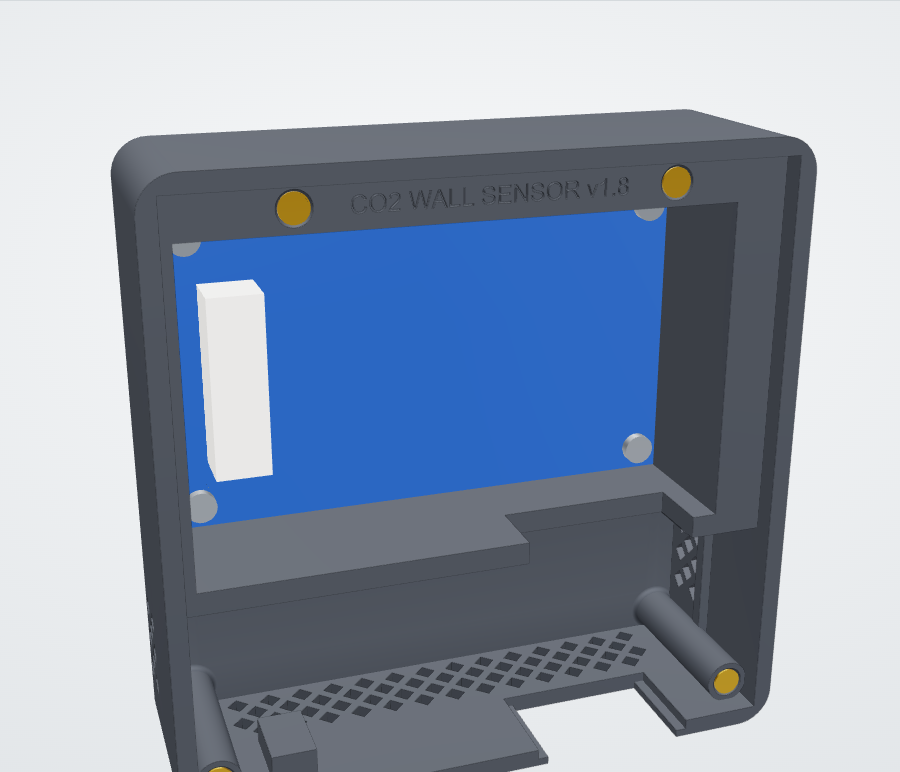

**You need:** Display, 4 screws M2 × 4, hex key 1.3 mm

Glass first into the display bay, then 4 screws M2 × 4 through the corner holes of the display board. ([see it in 3D](https://tobi136b.github.io/co2-wall-sensor/assembly.html#step-3))

> **Tip:** Test the electronics on the desk before you build them in: wire everything, flash the firmware and check the display. Keep the protective film on the glass until the end.

### Step 4 of 13: Sensor carrier

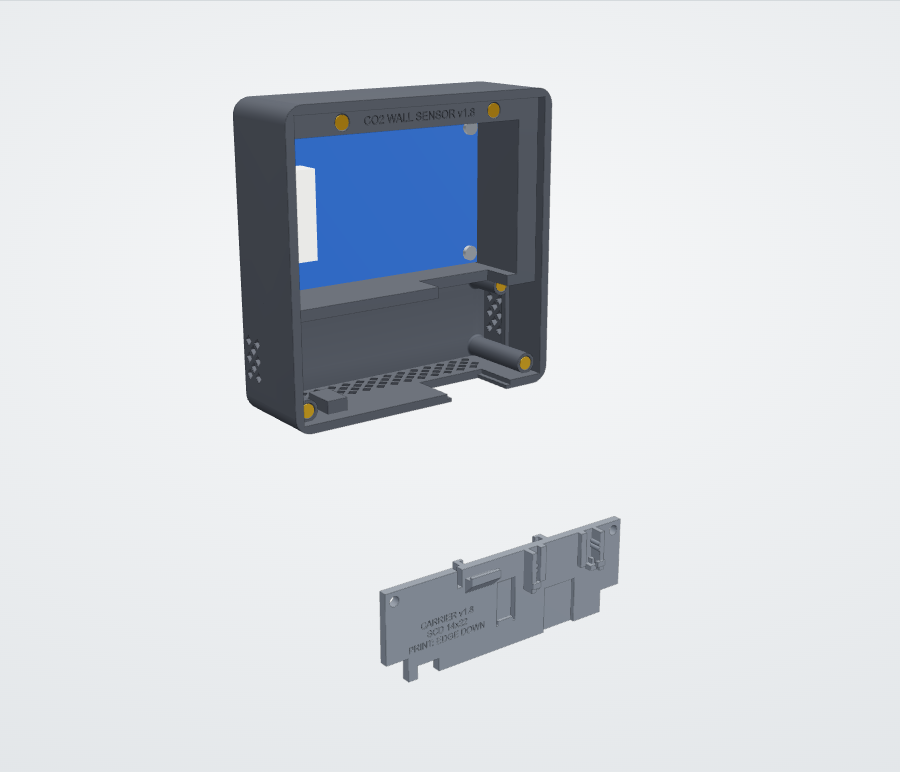

**You need:** Sensor carrier for your SCD41 board

The carrier is the removable floor of the sensor chamber. Print the one that matches your SCD41 board, here the 13.5 × 21.75 mm version. ([see it in 3D](https://tobi136b.github.io/co2-wall-sensor/assembly.html#step-4))

> **Tip:** Not sure which board you have? See [measure your sensor](measure-sensor.md).

### Step 5 of 13: SCD41 into the rails

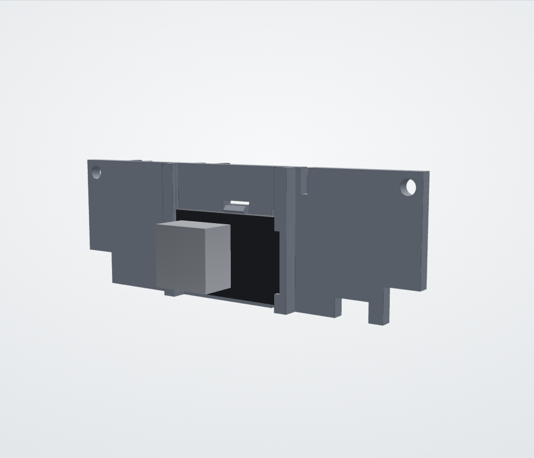

**You need:** SCD41, 4 wires of about 8 cm, soldering iron

Solder four wires of about 8 cm to the pads first. Then slide the board in from the top, sensor towards you, pads towards the wire slot. The spring tongue clicks over the upper edge. Lay the four wires side by side into the narrow slot from its open end and press them on the back under the lip of the wire clip. ([see it in 3D](https://tobi136b.github.io/co2-wall-sensor/assembly.html#step-5))

> **Tip:** To take the board out again, push the spring tongue back with a small screwdriver.

### Step 6 of 13: ESP32-C3 on the back

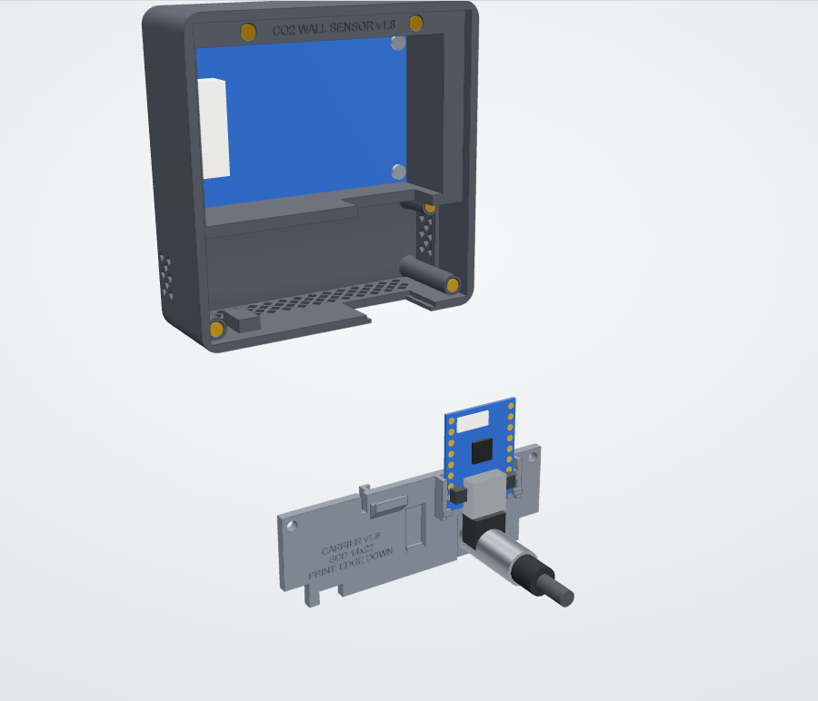

**You need:** ESP32-C3 SuperMini, USB cable with right-angle plug

Slide the ESP32-C3 from above between the side guides until it rests on the end stops and slips under the two small lips. Then plug the USB cable in from below, the carrier is open below the socket. ([see it in 3D](https://tobi136b.github.io/co2-wall-sensor/assembly.html#step-6))

> **Tip:** Back port module: lay the cable into the side slot of the module first. Bottom port module: push the straight plug through the module from outside first.

### Step 7 of 13: Carrier into the housing

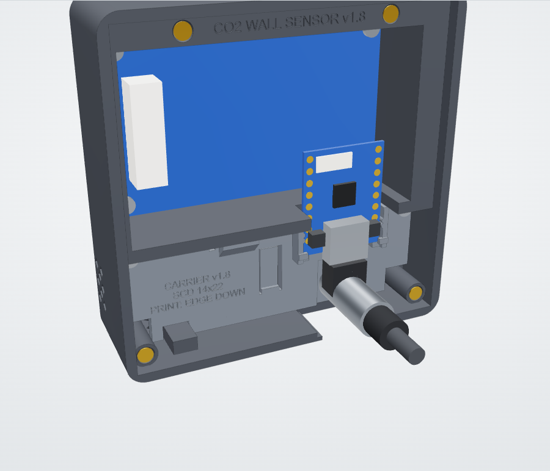

**You need:** 2 screws M2 × 4

Put the carrier onto the ledges in the chin and fix it with 2 screws M2 × 4. It closes the sensor chamber against the warm electronics. ([see it in 3D](https://tobi136b.github.io/co2-wall-sensor/assembly.html#step-7))

> **Tip:** Nothing to seal: the four SCD41 wires fill the narrow wire slot, so the sensor chamber stays apart from the warm electronics without glue.

### Step 8 of 13: Wiring

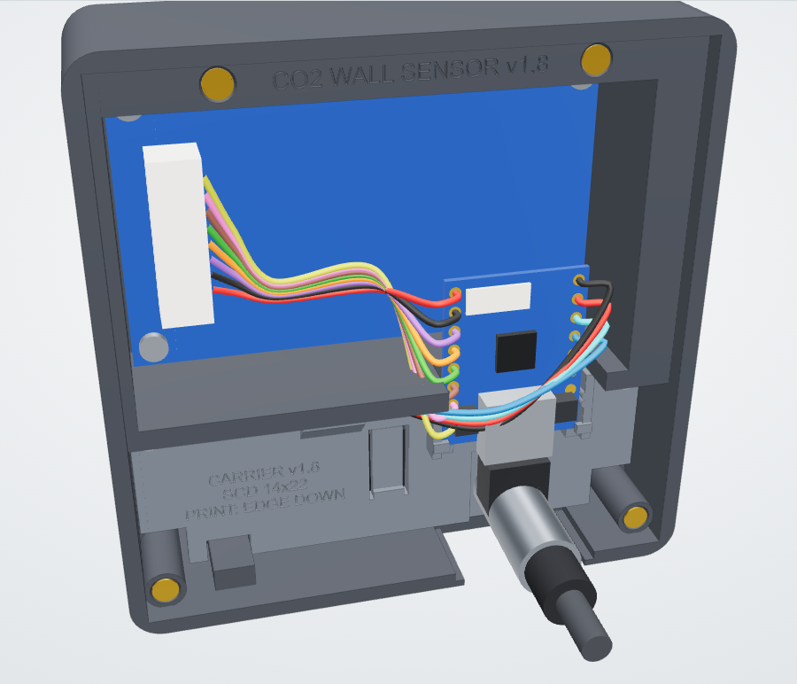

**You need:** The cable supplied with the display (shortened), soldering iron, the [wiring diagram](wiring.md)

Display: the 8 wires of the supplied cable run straight from the connector across the back of the display to the upper end of the ESP32-C3. SCD41: 4 wires through the wire slot and along the clip channel of the carrier. Colours as in the wiring diagram. ([see it in 3D](https://tobi136b.github.io/co2-wall-sensor/assembly.html#step-8))

> **Tip:** Shorten the display cable to about 5 cm before soldering. Then it lies flat and straight on the back of the display and cannot touch anything else.

### Step 9 of 13: Cable port module

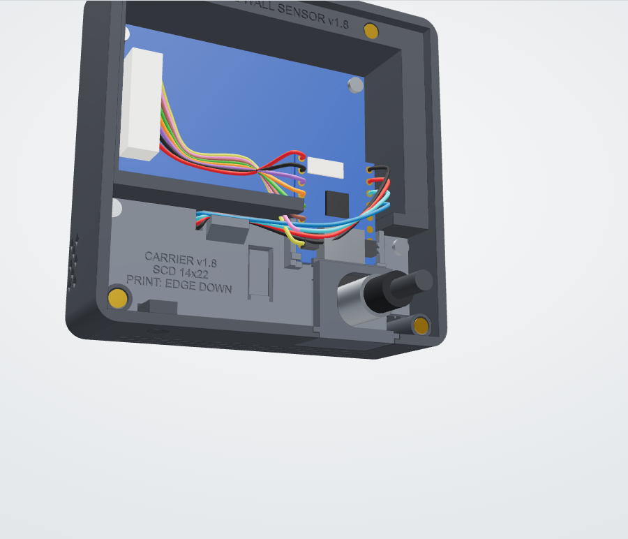

**You need:** Cable port module: back (right-angle plug) or bottom (straight plug)

Slide the module into the opening at the lower back edge. Back module for a right-angle plug into the wall box, bottom module for a cable on the wall. ([see it in 3D](https://tobi136b.github.io/co2-wall-sensor/assembly.html#step-9))

> **Tip:** Print both modules and decide on site. Swapping later takes four screws.

### Step 10 of 13: Back cover

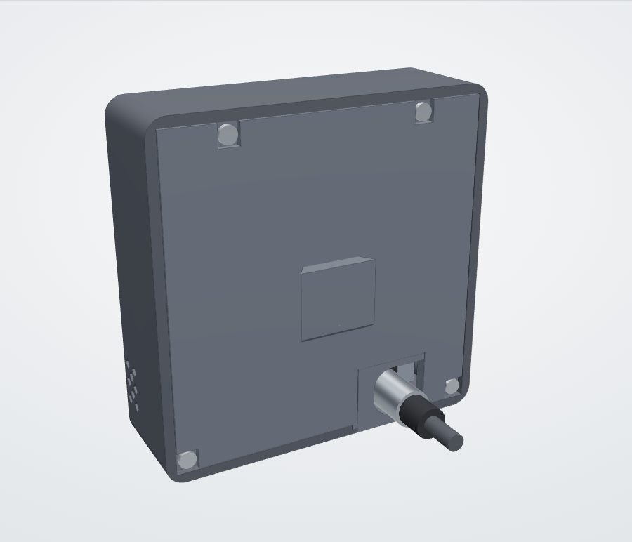

**You need:** Back cover, 4 screws M2 × 4

Put the cover into its seat and fix it with 4 screws M2 × 4. The heads sit below the surface, so the cover still slides onto the wall plate. ([see it in 3D](https://tobi136b.github.io/co2-wall-sensor/assembly.html#step-10))

> **Tip:** Nothing may stick out of the back: the heads sit below the surface, otherwise the device does not slide onto the wall plate.

### Step 11 of 13: Wall plate on the flush box

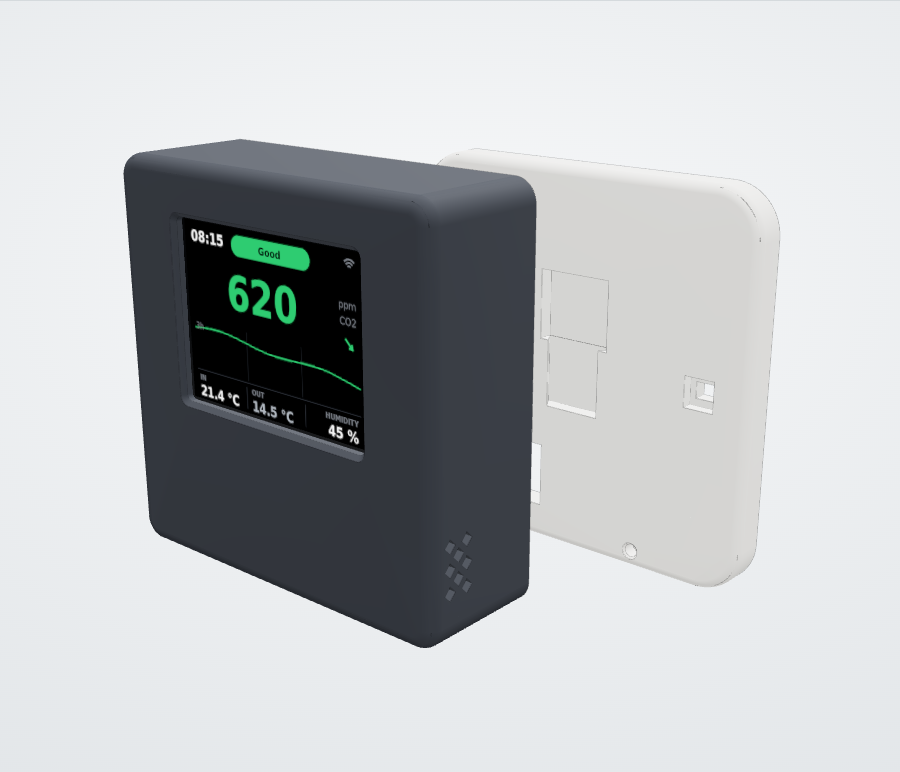

**You need:** Wall plate, the 2 screws of the flush box

Screw the wall plate to the two device screws of the flush box (60 mm apart). The slotted holes even out a slightly twisted box. ([see it in 3D](https://tobi136b.github.io/co2-wall-sensor/assembly.html#step-11))

> **Tip:** Power in the box: a flush mounted USB power module (work on 230 V only by a qualified electrician) or a USB cable inside the wall. Lead the cable through the passage of the plate.

### Step 12 of 13: Slide the device on

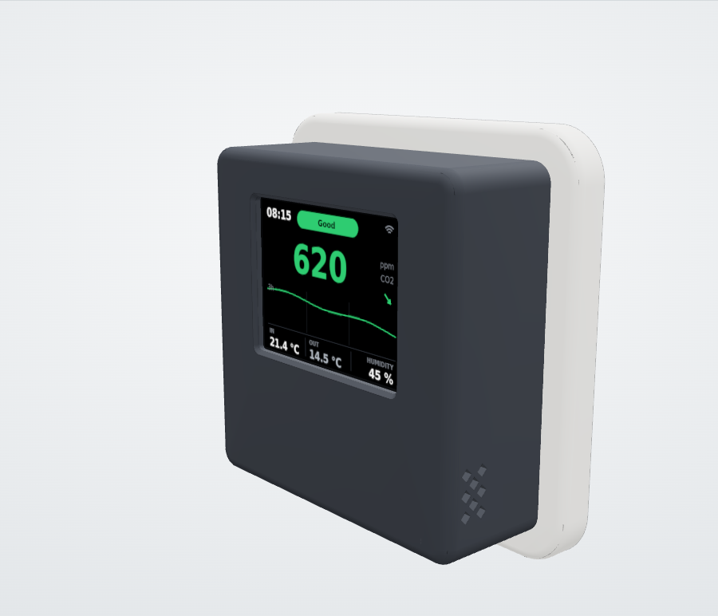

**You need:** Nothing

Hold the device in front of the plate, put the rail into the hidden window and slide it 15 mm down. Done. To remove it, slide it up and pull it off. ([see it in 3D](https://tobi136b.github.io/co2-wall-sensor/assembly.html#step-12))

> **Tip:** Plug the cable into the device before you put it on the rail.

### Step 13 of 13: Optional lock tab

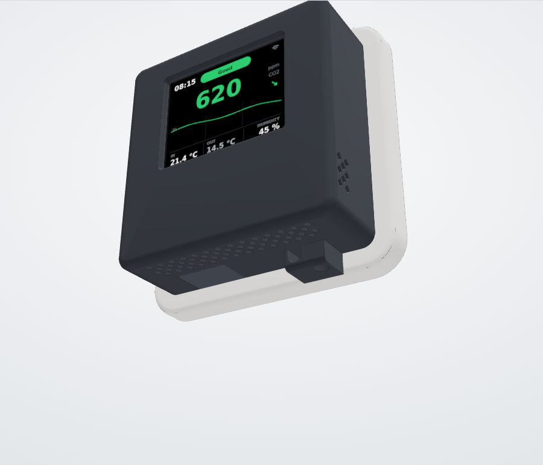

**You need:** Lock tab, 2 heat-set inserts and 2 screws M2 × 4

In an office, a school or with children, press one insert into the bottom of the housing and one into the wall plate, then screw the small tab on from below (2 screws M2 × 4). Then the device cannot be slid off the wall. ([see it in 3D](https://tobi136b.github.io/co2-wall-sensor/assembly.html#step-13))

> **Tip:** Only where needed. To take the device off later, remove the tab first.

<!-- steps:end -->

## 5. Desk stand

Use the back module with a right-angle plug. Place the device on the rail from above and slide it down. The device leans back by 12°, a 5 mm air gap below keeps the vents free. The cable runs out through the notch at the back of the foot.

## 6. Commissioning

**The easy way:** flash the firmware from the browser on the [project page](https://tobi136b.github.io/co2-wall-sensor/), enter your WiFi in the same window and adopt the device in Home Assistant. Firmware updates then appear in Home Assistant.

**Build it yourself:**

1. Copy `esphome/secrets.yaml.example` to `esphome/secrets.yaml` and fill it in.
2. Open the ESPHome Builder in Home Assistant and add `esphome/co2-wall-sensor.yaml` (English) or `esphome/co2-wall-sensor-de.yaml` (German) together with the `common` folder.
3. Flash via USB the first time, afterwards updates go over WiFi (OTA).

**After that, in both cases:**

1. **Calibration:** put the device next to an open window for 15 minutes, then press *Calibrate SCD41 (fresh air 420 ppm)* in Home Assistant. Automatic self calibration is enabled in addition.
2. **Temperature:** after 24 hours compare with a reference thermometer and set the difference as *Temperature correction* in Home Assistant. The humidity is corrected with it.
3. **Altitude:** set *Altitude above sea level* for your place, it makes the CO2 value more exact.
4. **Night and outdoor values:** night times, dimming or switching off, the window hint and the outdoor sensor are all set in Home Assistant, see [Home Assistant](../README.md#home-assistant).
