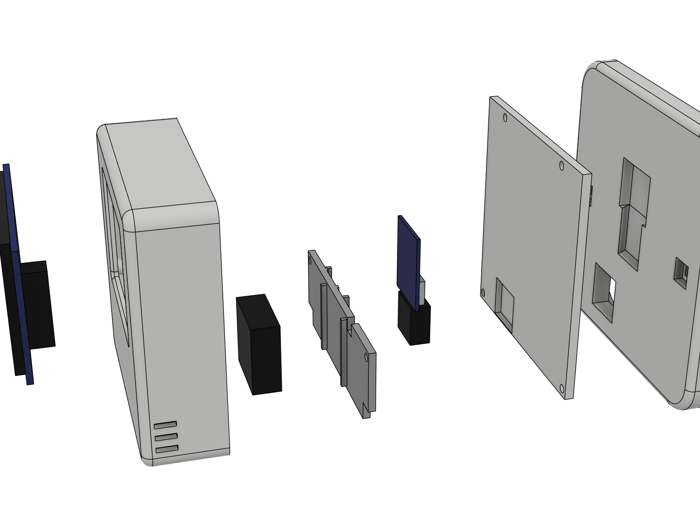

# Druck und Aufbau

[English](../assembly.md) | **Deutsch**

## 1. 3D-Druck

| Teil | Datei | Ausrichtung | Hinweise |
|------|-------|-------------|----------|
| Gehäuse | [`cad/stl/housing.stl`](../../cad/stl/housing.stl) | Front nach unten | Die Front liegt direkt auf dem Druckbett (eine strukturierte PEI-Platte sieht super aus). Kein Stützmaterial nötig. |
| Sensorträger | [`cad/stl/sensor_carrier.stl`](../../cad/stl/sensor_carrier.stl) | SCD41-Seite nach unten | Kleines flaches Teil, kein Stützmaterial. |
| Rückdeckel | [`cad/stl/back_cover.stl`](../../cad/stl/back_cover.stl) | Innenseite nach unten | Schiene zeigt nach oben, die Ausbrechmembran wird überbrückt. Kein Stützmaterial. |
| Wandplatte | [`cad/stl/wall_plate.stl`](../../cad/stl/wall_plate.stl) | Wandseite nach unten | Die Schwalbenschwanznut druckt ohne Stützmaterial. |
| Tischständer | [`cad/stl/desk_stand.stl`](../../cad/stl/desk_stand.stl) | auf der Seite | Auf der Seite gedruckt ist die Schiene am stabilsten. |

**Empfohlene Einstellungen:** PETG, 0,2 mm Schichthöhe, 3 Wände, 20 % Gyroid. PLA geht auch, kann aber im Sommer hinter einem sonnigen Fenster weich werden. Einen Slicer mit variabler Linienbreite nutzen (Arachne, Standard in PrusaSlicer, OrcaSlicer und Bambu Studio), damit die 0,6 mm dünnen Ausbrechmembranen gedruckt werden.

**Zwei Farben:** Gehäuse in Mattschwarz oder Anthrazit, Wandplatte in der Farbe der Lichtschalter (meist Reinweiß). Das Ergebnis wirkt wie ein Schaltereinsatz im Rahmen.

## 2. Verbindungselemente: eine Schraubensorte für alles

| Anz. | Teil | Wo |
|----:|------|----|
| 10 | Einschmelzmutter **M2 × 3**, Außendurchmesser 3,2 mm (Bohrung Ø 3,0 × 3,4 mm) | 4 Display, 4 Rückdeckel, 2 Sensorträger |
| 10 | Linsenkopfschraube (Halbrundkopf) **M2 × 4**, ISO 7380, Innensechskant 1,3 mm | gleiche Stellen |

Die einzigen anderen Schrauben sind die beiden, die der Hohlwanddose beiliegen.

## 3. Vormontage

1. **Alle 10 Einschmelzmuttern** von der offenen Rückseite mit dem Lötkolben eindrücken (ca. 200 bis 220 °C, wenn vorhanden mit M2-Spitze). Unter Eigengewicht einsinken lassen und bündig mit dem Dom aufhören.
   * 4 in die Displaydome rund um den Displayschacht. Die Front dahinter ist nur 1,1 mm dick, also mit wenig Temperatur und wenig Druck arbeiten, sonst zeichnet sich die Stelle vorne ab.
   * 4 für den Rückdeckel: 2 in den unteren Ecken, 2 im massiven Band über dem Display.
   * 2 für den Sensorträger in die kurzen Dome im Kinn.
2. **Elektronik zuerst auf dem Tisch testen.** Nach [verdrahtung.md](verdrahtung.md) verdrahten, Firmware flashen und das Display prüfen, bevor alles eingebaut wird.

## 4. Kabelaustritt wählen

Das Gehäuse ist für beide Kabelrichtungen vorbereitet. Die Entscheidung fällt erst jetzt, nach dem Druck:

| Austritt | Stecker | Einsatz | Was ausbrechen |
|----------|---------|---------|----------------|
| **Hinten** | USB-C Winkelstecker (90°, „nach oben/unten gewinkelt“) | Wandplatte mit Kabel aus der Hohlwanddose **und immer auf dem Tischständer** | Ausbrechfeld im Rückdeckel |
| **Unten** | gerader USB-C-Stecker | Kabel auf Putz an der Wand oder Powerbank unter dem Gerät | Ausbrechfeld in der Unterseite des Gehäuses |

Beide Ausbrechfelder sind 0,6 mm dünne Membranen, bündig und von außen unsichtbar. Von innen mit einem Cuttermesser am Rand entlang schneiden, Membran herausdrücken, Kante entgraten. Nur das benötigte Feld öffnen, das andere bleibt geschlossen und staubdicht.

## 5. Zusammenbau

1. **Display:** mit dem Glas voran in den Displayschacht legen und mit 4 × M2 × 4 in die Einschmelzmuttern schrauben.
2. **SCD41:** die Platinenrückseite mit einem Stück doppelseitigem Schaumklebeband zwischen die beiden Führungen auf der Frontseite des Sensorträgers kleben (die Seite zum Display). Der Sensor zeigt zur Gerätefront, Frischluft kommt durch die Schlitze unten und an den Seiten.
   > Im Modell steckt ein Platzhalter mit 20 × 20 × 8,1 mm. Eigene Platine nachmessen und vor dem Druck `SCD_W/SCD_H/SCD_T` im Generator anpassen.
3. **Sensorträger:** die SCD41-Litzen durch die Kerbe an der Oberkante führen, den Träger auf die Leisten im Kinn legen und mit 2 × M2 × 4 verschrauben. Der Träger schließt die Sensorkammer gegen die warme Elektronik ab.
4. **Kabelkerbe abdichten** mit einem Tropfen Heißkleber. So zieht keine warme Luft vom ESP in die Sensorkammer.
5. **ESP32-C3:** mit einem Streifen doppelseitigem Schaumklebeband auf die beiden Rippen auf der Rückseite des Trägers kleben, zwischen die Seitenführungen, **USB-C-Buchse zeigt nach unten**.
6. **Kabel:** USB-C-Kabel einstecken und durch das in Abschnitt 4 geöffnete Ausbrechfeld nach außen führen.
7. **Rückdeckel:** in den Sitz legen und mit 4 × M2 × 4 verschrauben. Die Linsenköpfe sitzen in Senkungen unter der Oberfläche, der Deckel gleitet weiterhin auf die Wandplatte.

## 6. Wandmontage auf der Hohlwanddose

1. **Strom in die Dose bringen:** entweder ein Unterputz-USB-Netzteil (Arbeiten an 230 V nur durch eine Elektrofachkraft) oder ein USB-Kabel, das in der Wand zu einer Steckdose läuft.
2. **Wandplatte** mit den beiden Geräteschrauben der Dose befestigen (60 mm Abstand, waagrecht). Die Langlöcher gleichen eine leicht verdrehte Dose aus.
3. USB-Kabel durch den Kabeldurchlass führen und ins Gerät stecken (Austritt hinten).
4. **Gerät aufsetzen:** vor die Platte halten, die Schiene in das verdeckte Einsetzfenster stecken und **15 mm nach unten schieben**. Fertig.

Zum Abnehmen 15 mm nach oben schieben und abziehen.

## 7. Tischständer

Austritt hinten mit Winkelstecker verwenden. Gerät von oben auf die Schiene setzen und nach unten schieben. Das Gerät lehnt 12° nach hinten, 5 mm Luftspalt unten halten die Lüftung frei. Das Kabel läuft durch die Kerbe hinten am Fuß hinaus.

## 8. Inbetriebnahme

1. `esphome/secrets.yaml.example` nach `esphome/secrets.yaml` kopieren und ausfüllen.
2. Im ESPHome Builder in Home Assistant `esphome/co2-wall-sensor-de.yaml` (deutsche Oberfläche) zusammen mit dem Ordner `common` anlegen.
3. Das erste Mal per USB flashen, danach kommen Updates über WLAN (OTA).
4. Home Assistant findet das Gerät. Integration bestätigen.
5. **Kalibrierung:** Gerät 15 Minuten neben ein offenes Fenster legen, dann in Home Assistant *SCD41 kalibrieren (Frischluft 420 ppm)* drücken. Die automatische Selbstkalibrierung ist zusätzlich aktiv.
6. **Temperatur:** nach 24 Stunden mit einem Referenzthermometer vergleichen und `temperature_offset` in der Gerätedatei anpassen.
