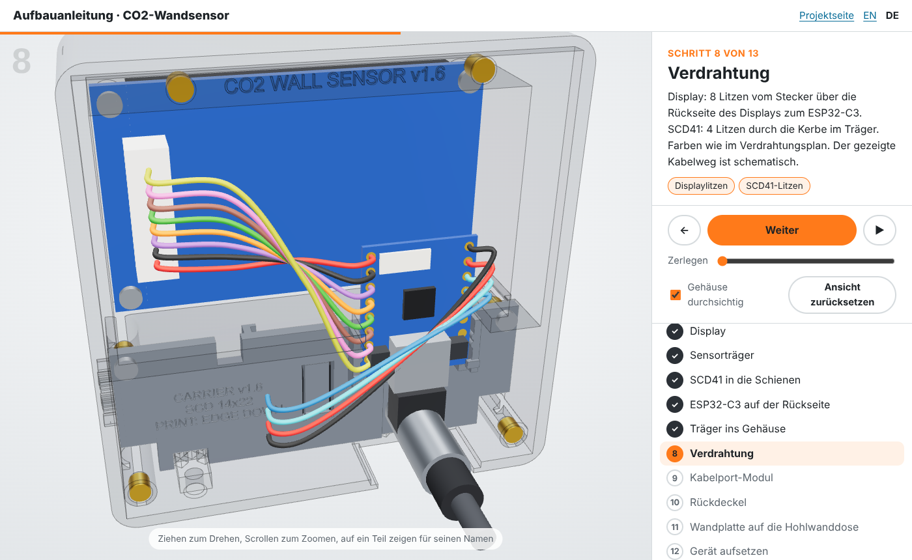

# Druck und Aufbau

[English](../assembly.md) | **Deutsch**

**Lieber in 3D?** Die [interaktive Aufbauanleitung](https://tobi136b.github.io/co2-wall-sensor/de/assembly.html) geht alle 13 Schritte durch. Gerät drehen, mit dem Schieberegler zerlegen, durch das Gehäuse schauen und sehen, welches Teil als Nächstes kommt.

## 1. 3D-Druck

Jedes Teil trägt auf einer verdeckten Fläche seinen Namen, die Version und die Drucklage als eingeprägte Beschriftung.

| Teil | Datei | Ausrichtung | Hinweise |
|------|-------|-------------|----------|
| Gehäuse | [`housing.stl`](../../cad/stl/housing.stl) | Front nach unten | Die Front liegt auf dem Druckbett (eine strukturierte PEI-Platte sieht super aus). Ein 45° Fuß an der Frontkante verhindert den Elefantenfuß. Kein Stützmaterial. |
| Sensorträger | [`sensor_carrier_14x22.stl`](../../cad/stl/sensor_carrier_14x22.stl) oder [`sensor_carrier_15x20.stl`](../../cad/stl/sensor_carrier_15x20.stl) | stehend auf der Unterkante | **Passend zu deiner SCD41-Platine**, siehe [Sensor ausmessen](sensor-ausmessen.md). Stehend gedruckt werden die Schienen zu senkrechten Kanälen und die Federzunge wächst nach oben. 5 mm Brim verwenden. |
| Rückdeckel | [`back_cover.stl`](../../cad/stl/back_cover.stl) | Innenseite nach unten | Beschriftung "THIS FACE DOWN". Schiene zeigt nach oben, kein Stützmaterial. |
| Kabelport hinten | [`cable_port_back.stl`](../../cad/stl/cable_port_back.stl) | große Rückfläche nach unten | Für einen Winkelstecker. |
| Kabelport unten | [`cable_port_bottom.stl`](../../cad/stl/cable_port_bottom.stl) | große Rückfläche nach unten | Für einen geraden Stecker. Am besten beide drucken, je 2 g. |
| Wandplatte | [`wall_plate.stl`](../../cad/stl/wall_plate.stl) | **Sichtseite nach unten** | Die Front bekommt die Oberfläche des Druckbetts. Andersherum müsste die 78 mm große Aussparung für den Dosenrand frei überbrückt werden. |
| Sicherungslasche (optional) | [`lock_tab.stl`](../../cad/stl/lock_tab.stl) | Vorderseite nach unten | Nur nötig, wenn sich das Gerät nicht ohne Werkzeug abnehmen lassen soll. |
| Tischständer | [`desk_stand.stl`](../../cad/stl/desk_stand.stl) | auf der Seite | Auf der Seite gedruckt ist die Schiene am stabilsten. |

**Empfohlene Einstellungen:** PETG, 0,2 mm Schichthöhe, 3 Wände, 20 % Gyroid, Nahtposition "hinten" oder "ausgerichtet". PLA geht auch, kann aber im Sommer hinter einem sonnigen Fenster weich werden.

**Zwei Farben:** Gehäuse in Mattschwarz oder Anthrazit, Wandplatte in der Farbe der Lichtschalter (meist Reinweiß). Das Ergebnis wirkt wie ein Schaltereinsatz im Rahmen.

**Passung zu stramm oder zu locker?** Alle Schiebe- und Steckpassungen hängen an einem Wert, `FIT` (0,3 mm je Seite). In Fusion unter *Ändern > Parameter ändern* anpassen, Skript erneut starten und das betroffene Teil neu drucken. Siehe [Designnotizen](design.md#parameter-in-fusion).

## 2. Verbindungselemente: eine Schraubensorte für alles

| Anz. | Teil | Wo |
|----:|------|----|
| 10 | Einschmelzmutter **M2 × 3**, Außendurchmesser 3,0 oder 3,2 mm (Bohrung Ø 2,9 × 3,4 mm passt für beide) | 4 Display, 4 Rückdeckel, 2 Sensorträger |
| 10 | Linsenkopfschraube (Halbrundkopf) **M2 × 4**, ISO 7380, Innensechskant 1,3 mm | gleiche Stellen |
| +2 | dieselbe Mutter und Schraube | optionale Sicherungslasche: 1 im Gehäuse, 1 in der Wandplatte |

Die einzigen anderen Schrauben sind die beiden, die der Hohlwanddose beiliegen. Im Gerät ist nichts geklebt.

## 3. Kabelaustritt wählen

Das Kabel verlässt das Gerät durch ein kleines, tauschbares **Kabelport-Modul** an der unteren hinteren Kante. Beide Versionen drucken und vor Ort entscheiden:

| Modul | Stecker | Einsatz |
|-------|---------|---------|
| **Port hinten** | USB-C Winkelstecker, "nach oben/unten gewinkelt" | Hohlwanddose und **immer auf dem Tischständer** |
| **Port unten** | gerader USB-C-Stecker, Steckerkörper höchstens 12 × 7 mm | Kabel auf Putz, Powerbank unter dem Gerät |

 

Das Modul wird zwischen Gehäuse und Rückdeckel geklemmt. Eine Stufe in der Unterseite verhindert, dass es herausfällt, eine Lippe unter dem Rückdeckel hält es nach hinten. Den Kabelaustritt später zu wechseln, kostet vier Schrauben.

**Zugentlastung:** Beim Modul hinten geht der runde Körper des Winkelsteckers durch ein Langloch, sein Kragen sitzt unter dem Modul. Zug am Kabel endet am Modul und nicht an der USB-Buchse.

## 4. Schritt für Schritt

**Bevor du anfängst, leg dir bereit:** Lötkolben mit feiner Spitze, Innensechskant 1,3 mm, kleiner Schlitzschraubendreher, Seitenschneider. Alle 13 Schritte gibt es auch in der [3D-Aufbauanleitung](https://tobi136b.github.io/co2-wall-sensor/de/assembly.html), dort kannst du jeden Schritt drehen und das Gerät zerlegen.

<!-- steps:start (generated from site/assembly_steps.yaml) -->

### Schritt 1 von 13: Das Gehäuse

**Du brauchst:** Gedrucktes Gehäuse

Mit der Front nach unten gedruckt. Du schaust von hinten darauf, auf die Seite, die später zur Wand zeigt. ([in 3D ansehen](https://tobi136b.github.io/co2-wall-sensor/de/assembly.html#step-1))

> **Tipp:** Kein Stützmaterial nötig. Den Rand (Brim) entfernen und prüfen, dass die vier Deckelsitze in den Ecken sauber sind.

### Schritt 2 von 13: 10 Einschmelzmuttern

**Du brauchst:** 10 Einschmelzmuttern M2 × 3, Lötkolben auf 200 bis 220 °C

Die M2-Muttern mit dem Lötkolben eindrücken (ca. 200 bis 220 °C). 4 rund um den Displayschacht, 4 für den Rückdeckel, 2 für den Sensorträger. Die Einführschräge zentriert sie. ([in 3D ansehen](https://tobi136b.github.io/co2-wall-sensor/de/assembly.html#step-2))

> **Tipp:** Mutter auf das Loch setzen, mit dem Lötkolben antippen und unter Eigengewicht einsinken lassen, bis sie bündig ist. Nicht drücken. Hinter den 4 Displaydomen ist die Front nur 1,1 mm dick: wenig Hitze, kein Druck.

### Schritt 3 von 13: Display

**Du brauchst:** Display, 4 Schrauben M2 × 4, Innensechskant 1,3 mm

Mit dem Glas voran in den Displayschacht legen, dann 4 Schrauben M2 × 4 durch die Ecklöcher der Displayplatine. ([in 3D ansehen](https://tobi136b.github.io/co2-wall-sensor/de/assembly.html#step-3))

> **Tipp:** Die Elektronik vorher auf dem Tisch testen: alles verdrahten, Firmware flashen und das Display prüfen. Die Schutzfolie auf dem Glas bis zum Schluss drauflassen.

### Schritt 4 von 13: Sensorträger

**Du brauchst:** Sensorträger für deine SCD41-Platine

Der Träger ist der herausnehmbare Boden der Sensorkammer. Drucke den, der zu deiner SCD41-Platine passt, hier die Version 13,5 × 21,75 mm. ([in 3D ansehen](https://tobi136b.github.io/co2-wall-sensor/de/assembly.html#step-4))

> **Tipp:** Unsicher, welche Platine du hast? Siehe [Sensor ausmessen](sensor-ausmessen.md).

### Schritt 5 von 13: SCD41 in die Schienen

**Du brauchst:** SCD41, 4 Litzen von ca. 8 cm, Lötkolben

Zuerst vier Litzen von ca. 8 cm an die Lötpunkte löten. Dann die Platine von oben einschieben, Sensor zeigt zu dir, Lötpunkte zum Kabelschlitz. Die Federzunge schnappt über die Oberkante. Die vier Litzen nebeneinander von der offenen Seite in den schmalen Schlitz legen und auf der Rückseite unter die Lippe des Kabelclips drücken. ([in 3D ansehen](https://tobi136b.github.io/co2-wall-sensor/de/assembly.html#step-5))

> **Tipp:** Zum Herausnehmen die Federzunge mit einem kleinen Schraubendreher zurückdrücken.

### Schritt 6 von 13: ESP32-C3 auf der Rückseite

**Du brauchst:** ESP32-C3 SuperMini, USB-Kabel mit Winkelstecker

Den ESP32-C3 von oben zwischen die Seitenführungen schieben, bis er auf den Anschlägen sitzt und unter die beiden kleinen Lippen rutscht. Dann das USB-Kabel von unten einstecken, der Träger ist unter der Buchse offen. ([in 3D ansehen](https://tobi136b.github.io/co2-wall-sensor/de/assembly.html#step-6))

> **Tipp:** Modul hinten: das Kabel vorher seitlich in den Schlitz des Moduls legen. Modul unten: den geraden Stecker vorher von außen durch das Modul schieben.

### Schritt 7 von 13: Träger ins Gehäuse

**Du brauchst:** 2 Schrauben M2 × 4

Den Träger auf die Leisten im Kinn legen und mit 2 Schrauben M2 × 4 festschrauben. Er schließt die Sensorkammer gegen die warme Elektronik ab. ([in 3D ansehen](https://tobi136b.github.io/co2-wall-sensor/de/assembly.html#step-7))

> **Tipp:** Nichts abdichten: Die vier SCD41-Litzen füllen den schmalen Kabelschlitz, so bleibt die Sensorkammer ohne Kleber von der warmen Elektronik getrennt.

### Schritt 8 von 13: Verdrahtung

**Du brauchst:** Das Kabel, das dem Display beiliegt (gekürzt), Lötkolben, den [Verdrahtungsplan](verdrahtung.md)

Display: Die 8 Adern des mitgelieferten Kabels laufen vom Stecker gerade über die Rückseite des Displays zum oberen Ende des ESP32-C3. SCD41: 4 Litzen durch den Kabelschlitz und am Kabelclip des Trägers entlang. Farben wie im Verdrahtungsplan. ([in 3D ansehen](https://tobi136b.github.io/co2-wall-sensor/de/assembly.html#step-8))

> **Tipp:** Das Displaykabel vor dem Löten auf ca. 5 cm kürzen. Dann liegt es flach und gerade auf der Rückseite des Displays und kann nirgends anstoßen.

### Schritt 9 von 13: Kabelport-Modul

**Du brauchst:** Kabelport-Modul: hinten (Winkelstecker) oder unten (gerader Stecker)

Das Modul in die Öffnung an der unteren hinteren Kante schieben. Modul hinten für den Winkelstecker in die Wanddose, Modul unten für ein Kabel auf Putz. ([in 3D ansehen](https://tobi136b.github.io/co2-wall-sensor/de/assembly.html#step-9))

> **Tipp:** Beide Module drucken und vor Ort entscheiden. Später wechseln kostet vier Schrauben.

### Schritt 10 von 13: Rückdeckel

**Du brauchst:** Rückdeckel, 4 Schrauben M2 × 4

Den Deckel in seinen Sitz legen und mit 4 Schrauben M2 × 4 festschrauben. Die Köpfe liegen unter der Oberfläche, der Deckel gleitet trotzdem auf die Wandplatte. ([in 3D ansehen](https://tobi136b.github.io/co2-wall-sensor/de/assembly.html#step-10))

> **Tipp:** Hinten darf nichts überstehen: Die Köpfe liegen versenkt, sonst lässt sich das Gerät nicht auf die Wandplatte schieben.

### Schritt 11 von 13: Wandplatte auf die Hohlwanddose

**Du brauchst:** Wandplatte, die 2 Schrauben der Hohlwanddose

Die Wandplatte mit den beiden Geräteschrauben der Hohlwanddose festschrauben (60 mm Abstand). Die Langlöcher gleichen eine leicht verdrehte Dose aus. ([in 3D ansehen](https://tobi136b.github.io/co2-wall-sensor/de/assembly.html#step-11))

> **Tipp:** Strom in der Dose: ein Unterputz-USB-Netzteil (Arbeiten an 230 V nur durch eine Elektrofachkraft) oder ein USB-Kabel in der Wand. Das Kabel durch den Durchlass der Platte führen.

### Schritt 12 von 13: Gerät aufsetzen

**Du brauchst:** Nichts

Gerät vor die Platte halten, die Schiene in das verdeckte Fenster stecken und 15 mm nach unten schieben. Fertig. Zum Abnehmen nach oben schieben und abziehen. ([in 3D ansehen](https://tobi136b.github.io/co2-wall-sensor/de/assembly.html#step-12))

> **Tipp:** Das Kabel ins Gerät stecken, bevor du es auf die Schiene setzt.

### Schritt 13 von 13: Optionale Sicherungslasche

**Du brauchst:** Sicherungslasche, 2 Einschmelzmuttern und 2 Schrauben M2 × 4

Im Büro, in der Schule oder bei Kindern je eine Mutter unten ins Gehäuse und in die Wandplatte einschmelzen, dann die kleine Lasche von unten anschrauben (2 Schrauben M2 × 4). Dann lässt sich das Gerät nicht mehr von der Wand schieben. ([in 3D ansehen](https://tobi136b.github.io/co2-wall-sensor/de/assembly.html#step-13))

> **Tipp:** Nur wo nötig. Zum Abnehmen später zuerst die Lasche abschrauben.

<!-- steps:end -->

## 5. Tischständer

Das Modul hinten mit Winkelstecker verwenden. Gerät von oben auf die Schiene setzen und nach unten schieben. Das Gerät lehnt 12° nach hinten, 5 mm Luftspalt unten halten die Lüftung frei. Das Kabel läuft durch die Kerbe hinten am Fuß hinaus.

## 6. Inbetriebnahme

**Der einfache Weg:** Firmware auf der [Projektseite](https://tobi136b.github.io/co2-wall-sensor/) direkt aus dem Browser flashen, im selben Fenster das WLAN eintragen und das Gerät in Home Assistant übernehmen. Firmware-Updates erscheinen danach in Home Assistant.

**Selbst bauen:**

1. `esphome/secrets.yaml.example` nach `esphome/secrets.yaml` kopieren und ausfüllen.
2. Im ESPHome Builder in Home Assistant `esphome/co2-wall-sensor-de.yaml` (deutsche Oberfläche) zusammen mit dem Ordner `common` anlegen.
3. Das erste Mal per USB flashen, danach kommen Updates über WLAN (OTA).

**Danach in beiden Fällen:**

1. **Kalibrierung:** Gerät 15 Minuten neben ein offenes Fenster legen, dann in Home Assistant *SCD41 kalibrieren (Frischluft 420 ppm)* drücken. Die automatische Selbstkalibrierung ist zusätzlich aktiv.
2. **Temperatur:** nach 24 Stunden mit einem Referenzthermometer vergleichen und den Unterschied in Home Assistant als *Temperaturkorrektur* eintragen. Die Luftfeuchte wird damit mitkorrigiert.
3. **Höhe:** *Höhe über dem Meer* für deinen Ort einstellen, das macht den CO2-Wert genauer.
4. **Nacht und Außenwerte:** Nachtzeit, Dimmen oder Ausschalten, Fensterhinweis und Außenfühler stellst du alles in Home Assistant ein, siehe [Home Assistant](../../README.de.md#home-assistant).
