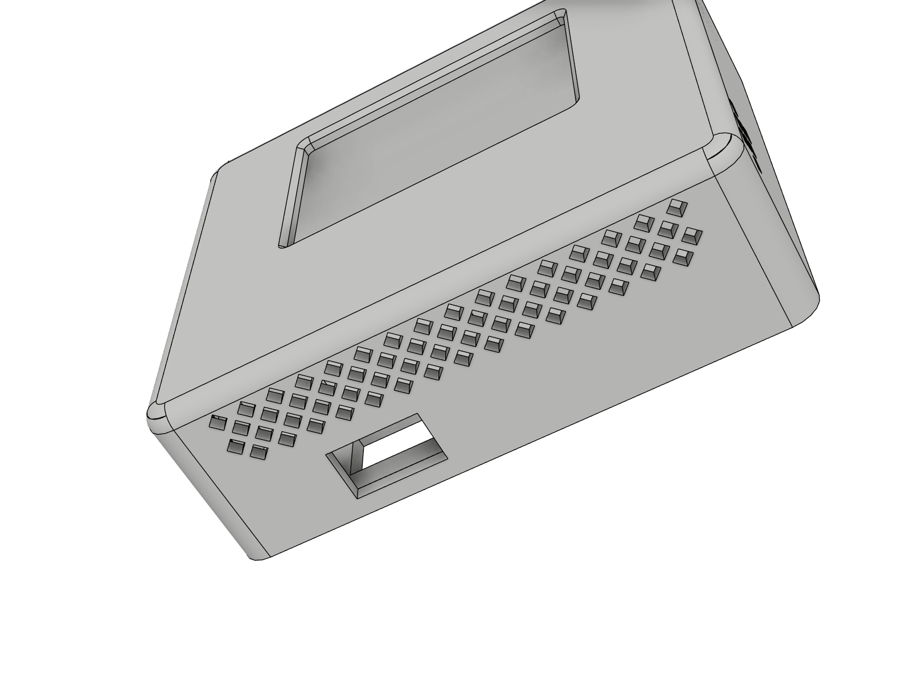

# Designnotizen

[English](../design.md) | **Deutsch**

Hier steht, warum das Gerät so aussieht und so funktioniert, wie es ist.

## Ziele

1. Luftqualität, Temperatur, Luftfeuchte und Uhrzeit **auf einem Bildschirm**, lesbar quer durch den Raum.
2. **Kein sichtbares Kabel** an der Wand, aber auch auf dem Schreibtisch nutzbar.
3. **Vertrauenswürdige Messwerte**, die nicht vom Gerät selbst verfälscht werden.
4. Alles nachbaubar und anpassbar: **parametrisches CAD, generierte Doku**.

## Warum ein SCD41?

Günstige „CO2“-Sensoren wie SGP30 oder CCS811 schätzen nur einen CO2-Äquivalenzwert aus flüchtigen organischen Verbindungen. Der SCD41 misst CO2 direkt (photoakustisch, NDIR) mit ±(50 ppm + 5 % vom Messwert) und liefert dazu Temperatur und Luftfeuchte. Er braucht freien Luftaustausch, und genau das bestimmt den Aufbau des Gehäuses.

## Thermik

Jedes elektronische Gerät heizt sich selbst auf. Ein ESP32 mit WLAN und ein Display-Hintergrundlicht heben einen eingebauten Sensor schnell um mehrere Kelvin an. Gegenmaßnahmen:

* **Eigene Sensorkammer** im Kinn des Gehäuses, zum Display durch eine Trennwand und zum ESP durch den verschraubten Sensorträger abgeschlossen. Der Träger ist ein eigenes Teil, dadurch lässt sich der SCD41 leicht einbauen und tauschen.
* **Luft kommt von unten** durch ein Rautengitter im Boden und an beiden Seiten der Sensorkammer. Warme Luft der Elektronik steigt hinter dem Display nach oben, weg vom Sensor.
* **ESP32-C3 statt klassischem ESP32:** ein Kern, kein USB-UART-Chip, kein Laderegler. Weniger Abwärme.
* **Schmaler Kabelschlitz statt Kerbe:** Die vier SCD41-Litzen liegen nebeneinander im 1,3 mm breiten Schlitz und füllen ihn aus. So wird ohne Kleber keine warme Luft vom ESP in die Kammer gezogen. Auf der Rückseite hält ein mitgedruckter Kabelclip die Litzen.
* **Nachtmodus** dimmt das Hintergrundlicht und reduziert dabei auch die Wärme.
* Der Rest wird mit `temperature_offset` in der Firmware ausgeglichen (Standard 2,0 °C, mit Referenz prüfen).

## Geschlossene Front

Die Front hat keine Öffnungen. Staub setzt sich vor allem auf Öffnungen, die nach oben oder vorne zeigen, und eine durchgehende Front wirkt einfach ruhiger. Alle Lüftungsschlitze zeigen nach unten oder zur Seite.

## Montage: Schwalbenschwanzschiene

Eine kurze Schwalbenschwanzschiene am Rückdeckel passt in zwei Adapter:

* **Wandplatte 89,2 × 82 mm.** Sie ist rundum 6,1 mm größer als das Gerät und hat zum Gerät konzentrische Ecken. So entsteht ein gleichmäßiger Rahmen wie bei einem Lichtschalter. Zwei Schrauben M4 mit Dübeln halten sie, 60 mm auseinander in Langlöchern mit 3 mm Spiel nach oben und unten und einer 45°-Senkung für Senkköpfe. Dieselben Langlöcher nehmen die Schrauben einer Hohlwanddose (68 mm Bohrung, Rand ca. 75 mm), die die Platte verdeckt.
* **Tischständer.** Gleiche Schiene, das Gerät lehnt für bessere Lesbarkeit 12° nach hinten, mit 5 mm Luftspalt unten, damit die Lüftung frei bleibt.

Das Einsetzfenster über der Nut liegt verdeckt hinter dem Gerät. Gerät von vorne einsetzen und 15 mm nach unten schieben. Von außen ist nichts zu sehen, abnehmen geht ohne Werkzeug.

## Verschraubung: eine Schraubensorte, nur Metallgewinde

Kunststoffgewinde nutzen sich nach wenigen Zyklen ab, und selbstschneidende Schrauben sprengen dünne Dome. Deshalb sitzt an jeder Schraubstelle eine Einschmelzmutter aus Messing, überall mit denselben Teilen:

* **10 × Einschmelzmutter M2 × 3** (Außendurchmesser 3,0 oder 3,2 mm, Bohrung Ø 2,9 × 3,4 mm passt für beide): 4 für das Display, 4 für den Rückdeckel, 2 für den Sensorträger.
* **10 × Linsenkopfschraube (Halbrundkopf) M2 × 4, ISO 7380.** Ein Innensechskantschlüssel für das ganze Gerät.
* **2 × Schraube M4** mit Dübeln für die Wandplatte, die einzigen anderen Schrauben.

Der Rückdeckel wird an vier Punkten gehalten: zwei Dome in den unteren Ecken und zwei Einschmelzmuttern in einem massiven 5 mm Band über dem Displayschacht. Die Linsenköpfe sitzen in 1,3 mm tiefen Senkungen, die Deckelfläche bleibt plan und gleitet sauber auf Wandplatte und Tischständer. Der Deckel hat innen weder Stifte noch Haken und druckt flach ohne Stützmaterial.

## Nichts ist geklebt

* **SCD41:** Die Platine hat keine Befestigungslöcher. Sie wird von oben in zwei Schienen mit Nut auf der Frontseite des Sensorträgers geschoben und steht auf einem Anschlag. Eine aus dem Träger ausgeschnittene Zunge trägt einen 45° Haken, der über die Oberkante schnappt und die Platine auf den Anschlag drückt. So werden Toleranzen von ±0,4 mm spielfrei ausgeglichen. Nur dieser Träger hängt von der Platine ab: Es gibt einen pro Platinenprofil, siehe [Sensor ausmessen](sensor-ausmessen.md).
* **ESP32-C3:** Auch er hat keine Befestigungslöcher. Er gleitet auf einem Schlitten, der ihn auf ganzer Länge trägt, zwischen Seitenführungen mit Quetschrippen nach unten, bis er auf zwei Anschlägen steht und in eine kurze Nut an seiner Unterkante rutscht. Dann schnappt ein Haken auf einer Federzunge hinter seine Oberkante, mit gerader Fläche, damit die Steckkraft die Platine nicht nach oben drückt. Der Schlitten reicht über die Trennwand in den Displayschacht, 0,3 mm über dem Displaystecker. Die Nut sitzt dort, wo die Platine keine Lötpunkte hat, an beiden Längsseiten können also Litzen angelötet werden.
* **Displaykabel:** Es bleibt im Display stecken. Der Displayschacht ist auf einer Seite länger, das Display passt also nur mit dem Stecker dort hinein, und der Elektronikstreifen des Glases liegt immer hinter dem Rahmen; dafür ist das Gerät 77 mm breit, das Fenster bleibt mittig. Das Flachkabel läuft unter einer mitgedruckten Brücke auf dem Schlitten, der Rückdeckel schließt sie von hinten.
* **Sensorträger:** zwei Schrauben. Er ist der herausnehmbare Boden der Sensorkammer, der Sensor lässt sich tauschen, ohne das Display anzufassen.

## Kabelaustritt: dieselben Teile für beide Wege

Der ESP32-C3 sitzt mit der USB-C-Buchse **nach unten**, darunter sind 12,5 mm frei.

* **Nach hinten:** ein USB-C-Winkeladapter 90° (Stecker auf Buchse) in der Buchse, sein Körper zeigt zur Wand. Er geht durch ein Loch im Rückdeckel, und ein beliebiges USB-C-Kabel läuft gerade in die Hohlwanddose oder durch den Tischständer. Der Träger ist unter der Buchse offen, der Adapter kommt also mit der Platine, vor dem Träger.
* **Nach unten:** ein gerader Stecker im Fenster der Bodenwand, das seinen Steckerkörper mit 0,2 mm Spiel hält.

Bis Version 1.8 schloss ein kleines loses Port-Modul in zwei Versionen die Öffnung. Es ließ sich schlecht einsetzen und fiel heraus, bevor der Deckel drauf war, und Winkelstecker unterscheiden sich darin, in welche Richtung sie abknicken. Der Adapter legt die Richtung fest, und Fenster und Loch brauchen kein Zusatzteil. Dünne Ausbrechmembranen wurden vorher ausprobiert (v1.2), lassen sich nach dem Ausbrechen aber nicht wieder schließen.

## Details für den Druck

* **45° Fuß an Kanten auf dem Druckbett.** Eine Rundung, die tangential auf dem Druckbett beginnt, druckt schlecht: Die untersten Schichten sind fast waagrecht, und die erste Schicht quillt seitlich heraus (Elefantenfuß). Die weiche Frontkante endet deshalb in einer kurzen 45° Schräge, die tangential in die Rundung übergeht. Sie sieht rund aus, druckt aber sauber.
* **Einführschrägen** an allen Mutterlöchern zentrieren die Mutter und geben dem verdrängten Kunststoff Platz.
* **Verrundungen am Fuß der Dome** machen sie stabiler, sie brechen beim Eindrücken der Muttern nicht ab.
* **Einführschräge an der Schiene**, damit das Gerät die Nut leicht findet.
* **Eingeprägte Beschriftung** auf verdeckten Flächen: die Gehäuseversion in kräftiger Schrift, 0,6 mm tief und mindestens 2,4 mm hoch, damit jeder Strich mindestens eine saubere Linie einer 0,4 mm Düse ergibt. Der Generator verkleinert jeden Text, bis er in sein Feld passt.
* **Ein Passungswert** (`FIT`) für alle Schiebe- und Steckpassungen.
* **Ausgelegt für eine 0,4 mm Düse.** Keine Wand ist dünner als `MIN_WALL` (0,8 mm, zwei Linien). Wo eine Senkung für einen Schraubenkopf am Rand eines Teils eine dünnere Haut lassen würde, ist die Senkung zum Rand hin offen; die Gehäusewand schließt sie von außen. Die CI misst die Wandstärke jeder STL-Datei flächendeckend (`tools/print_check.py`) und schlägt unter 0,8 mm fehl.
* **Rautengitter** statt Schlitzen: Die 45° Kanten drucken an den senkrechten Wänden ohne Stützmaterial, die Stege sind 1 mm breit und die offene Fläche ist rund 40 % größer als mit den alten Schlitzen.

  

## Parameter in Fusion

Jeder Wert des Parameterblocks wird ein Fusion-Benutzerparameter (*Ändern > Parameter ändern*), mit seiner Erklärung als Kommentar. Zum Ändern die Werte dort anpassen und das Skript erneut starten: Es liest die Parameter der offenen Konstruktion und baut alle Teile damit neu, inklusive Kollisionsprüfung. Das Modell entsteht per Skript und hat keine von Hand aufgebaute Zeitleiste, ein geänderter Wert wirkt also beim Skriptlauf und nicht sofort in der Zeitleiste.

Die Baugruppe hat ein Schiebegelenk ("RailSlider"): Das Gerät lässt sich 15 mm auf der Schiene nach oben schieben, genau wie beim Abnehmen von der Wandplatte.

## Stromversorgung

Das Gerät hängt dauerhaft an USB-C (ca. 0,5 W, grob 4 bis 5 kWh im Jahr). Eine Akkuversion wurde geprüft und verworfen: Ein Farbdisplay braucht dauerhaft Strom, und Lithiumzellen in einem geschlossenen Gehäuse an der Wand sind ein unnötiges Risiko.

## Parametrisches CAD und generierte Doku

Das Gehäuse wird nicht von Hand modelliert. [`generate_enclosure.py`](../../cad/fusion/generate_enclosure/generate_enclosure.py) baut alle Teile aus einem einzigen Parameterblock, prüft Wand- und Tischaufbau auf Kollisionen und exportiert auf Wunsch STL und STEP. [Technische Zeichnung](../../tools/drawing.py), [Verdrahtungsplan](../../tools/wiring.py) und [Displayvorschau](../../tools/display_preview.py) entstehen aus denselben Quellen. Wer ein Maß ändert, hält Modell, Zeichnung und Doku automatisch gleich.
