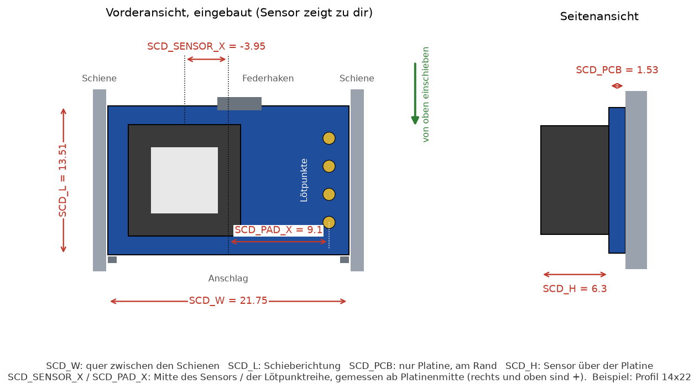

# SCD41-Platine ausmessen

[English](../measure-sensor.md) | **Deutsch**

SCD41-Platinen gibt es in mehreren Größen, und das Foto im Shop zeigt oft eine andere Platine als die, die ankommt. Das Gehäuse löst das mit **einem kleinen Teil**: dem Sensorträger. Gehäuse, Rückdeckel, Kabelports, Wandplatte und Tischständer sind für jede Platine gleich.

## 1. Mit den bekannten Platinen vergleichen

Länge und Breite der Platine ohne Bauteile mit dem Messschieber messen.

| Platine | Größe | Träger | Hinweise |
|---------|-------|--------|----------|
| **14x22** | 13,5 × 21,75 mm, Platine 1,5 mm | [`sensor_carrier_14x22.stl`](../../cad/stl/sensor_carrier_14x22.stl) | Lötpunkte GND, VDD, SCL, SDA an einer kurzen Kante. Liegt quer im Träger. 2026 die häufigste Platine. |
| **15x20** | 15 × 20 mm, Platine 1,6 mm | [`sensor_carrier_15x20.stl`](../../cad/stl/sensor_carrier_15x20.stl) | Steht hochkant im Träger. |

Abweichungen von ein paar Zehnteln sind kein Problem: Die **Federzunge** drückt die Platine auf ihren Anschlag und gleicht ±0,4 mm in Schieberichtung aus. Passt deine Platine, druckst du diesen Träger und bist fertig.

## 2. Andere Platine: sechs Werte messen

Die Platine so halten, **wie sie eingebaut wird**: Sensor zeigt zu dir, Lötpunkte auf der Seite des Kabelschlitzes (von vorne gesehen oben rechts).

| Parameter | Was messen |
|-----------|------------|
| `SCD_W` | Breite quer zwischen den Schienen, von Kante zu Kante |
| `SCD_L` | Länge in Schieberichtung |
| `SCD_PCB` | Dicke der Platine am Rand, ohne Bauteile |
| `SCD_H` | Gesamthöhe mit Sensor minus `SCD_PCB` |
| `SCD_SENSOR_X` | Mitte des Sensors ab Platinenmitte, rechts ist positiv |
| `SCD_PAD_X` | Mitte der Lötpunktreihe ab Platinenmitte, rechts ist positiv. `0`, wenn die Lötpunkte nicht an einer Schiene liegen |

In die Kammer passen Platinen bis 20 mm in Schieberichtung und rund 40 mm quer, fast jede Platine passt also in der einen oder anderen Lage.

## 3. Träger erzeugen

**Im Browser (am einfachsten):** den [Sensorträger-Konfigurator](https://tobi136b.github.io/co2-wall-sensor/de/configurator.html) öffnen, die sechs Werte eintragen und die STL herunterladen. Er erzeugt denselben Träger wie Fusion, die CI vergleicht beide für jede bekannte Platine.

**In Fusion:**

1. Das Skript in Fusion einmal ausführen (siehe [Gehäuse anpassen](../../README.de.md#gehäuse-anpassen)).
2. Die sechs Werte unter *Ändern > Parameter ändern* eintragen.
3. Das Skript mit `EXPORT = True` erneut ausführen. Es schreibt `cad/stl/sensor_carrier_custom.stl` und prüft, dass nichts kollidiert.
4. Nur den Träger drucken.

Bitte [ein Issue anlegen](https://github.com/tobi136B/co2-wall-sensor/issues/new/choose) mit deinen Werten und einem Foto der Platine. Sie wird als Profil aufgenommen, dann kann der Nächste den Träger einfach herunterladen.
