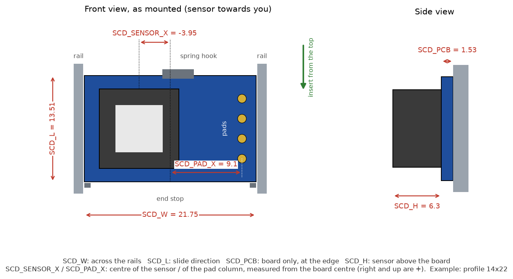

# Measure your SCD41 board

**English** | [Deutsch](de/sensor-ausmessen.md)

SCD41 breakout boards are sold in several sizes, and the photo in a shop often shows a different board than the one that arrives. The enclosure handles this with **one small part**: the sensor carrier. Housing, back cover, cable ports, wall plate and desk stand are the same for every board.

## 1. Compare with the known boards

Measure length and width of the bare board with a caliper.

| Board | Size | Carrier | Notes |
|-------|------|---------|-------|
| **14x22** | 13.5 × 21.75 mm, board 1.5 mm | [`sensor_carrier_14x22.stl`](../cad/stl/sensor_carrier_14x22.stl) | Pads GND, VDD, SCL, SDA on a short edge. Lies crosswise in the carrier. The most common board in 2026. |
| **15x20** | 15 × 20 mm, board 1.6 mm | [`sensor_carrier_15x20.stl`](../cad/stl/sensor_carrier_15x20.stl) | Stands upright in the carrier. |

Deviations of a few tenths of a millimetre are fine: the **spring tongue** presses the board onto its end stop and takes up ±0.4 mm in the slide direction. If your board matches, print that carrier and you are done.

## 2. Another board: measure six values

Hold the board **as it will be mounted**: sensor towards you, the pads on the side where the wire slot is (top right seen from the front).

| Parameter | What to measure |
|-----------|-----------------|
| `SCD_W` | Width across the rails, from edge to edge |
| `SCD_L` | Length in the slide direction |
| `SCD_PCB` | Thickness of the bare board at the edge, without components |
| `SCD_H` | Total height including the sensor minus `SCD_PCB` |
| `SCD_SENSOR_X` | Centre of the sensor from the centre of the board, right is positive |
| `SCD_PAD_X` | Centre of the pad column from the centre of the board, right is positive. `0` if the pads are not along a rail |

The chamber takes boards up to 20 mm in the slide direction and about 40 mm across, so almost every board fits one way or the other.

## 3. Create the carrier

**In the browser (easiest):** open the [sensor carrier configurator](https://tobi136b.github.io/co2-wall-sensor/configurator.html), enter the six values and download the STL. It builds the same carrier as Fusion, the CI compares both for every known board.

**In Fusion:**

1. Run the generator in Fusion once (see [Customising the enclosure](../README.md#customising-the-enclosure)).
2. Enter your six values under *Modify > Change Parameters*.
3. Run the script again with `EXPORT = True`. It writes `cad/stl/sensor_carrier_custom.stl` and checks that nothing collides.
4. Print only the carrier.

Please [open an issue](https://github.com/tobi136B/co2-wall-sensor/issues/new/choose) with your values and a photo of the board. It will be added as a profile so the next person can simply download the carrier.
