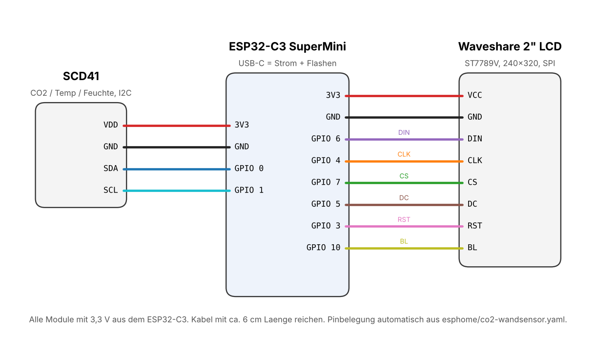

# Verdrahtung

Alle Module laufen mit 3,3 V direkt aus dem ESP32-C3 SuperMini. Strom kommt über die USB-C-Buchse des ESP.

## ESP32-C3 SuperMini zu Waveshare 2inch LCD (SPI)

| LCD | ESP32-C3 | Funktion |
|-----|----------|----------|
| VCC | 3V3      | Versorgung 3,3 V |
| GND | GND      | Masse |
| DIN | GPIO6    | SPI MOSI |
| CLK | GPIO4    | SPI Takt |
| CS  | GPIO7    | Chip Select |
| DC  | GPIO5    | Daten/Kommando |
| RST | GPIO3    | Reset |
| BL  | GPIO10   | Hintergrundlicht (PWM, dimmbar) |

## ESP32-C3 SuperMini zu SCD41 (I²C)

| SCD41 | ESP32-C3 | Funktion |
|-------|----------|----------|
| VDD   | 3V3      | Versorgung 3,3 V |
| GND   | GND      | Masse |
| SDA   | GPIO0    | I²C Daten |
| SCL   | GPIO1    | I²C Takt |

## Warum genau diese Pins?

* **GPIO2, GPIO8 und GPIO9** sind Strapping-Pins des ESP32-C3 (GPIO8 hängt zusätzlich an der blauen LED, GPIO9 am BOOT-Taster). Sie bleiben frei, damit das Board immer sauber startet.
* **GPIO18 und GPIO19** sind die USB-Datenleitungen und bleiben ebenfalls frei.
* **GPIO10** ist PWM-fähig und steuert die Displayhelligkeit, damit der Nachtmodus funktioniert.

Der Verdrahtungsplan wird mit `python tools/verdrahtung.py` direkt aus `esphome/co2-wandsensor.yaml` erzeugt. Wer Pins in der YAML ändert, erzeugt den Plan einfach neu.

## Tipps

* Kabellänge etwa 6 cm, dünne Litze (AWG 28 bis 30) passt gut durch die Kabeldurchführungen.
* Die SCD41-Leitungen durch die Kerbe im Zwischenboden führen und die Kerbe danach mit etwas Heißkleber abdichten. So zieht keine warme Luft vom ESP in die Sensorkammer.
* Vor dem Einbau einmal komplett auf dem Tisch testen.
