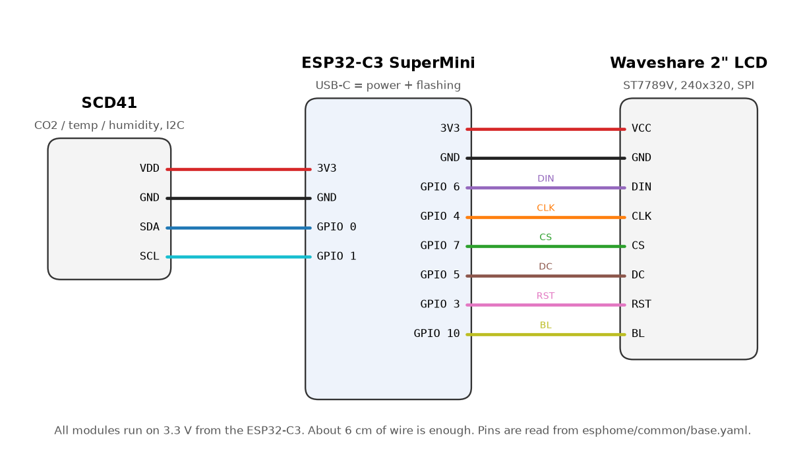

# Wiring

**English** | [Deutsch](de/verdrahtung.md)

All modules run on 3.3 V directly from the ESP32-C3 SuperMini. Power comes in through the USB-C socket of the ESP.

## ESP32-C3 SuperMini to Waveshare 2inch LCD (SPI)

| LCD | ESP32-C3 | Function |
|-----|----------|----------|
| VCC | 3V3      | 3.3 V supply |
| GND | GND      | ground |
| DIN | GPIO6    | SPI MOSI |
| CLK | GPIO4    | SPI clock |
| CS  | GPIO7    | chip select |
| DC  | GPIO5    | data / command |
| RST | GPIO3    | reset |
| BL  | GPIO10   | backlight (PWM, dimmable) |

## ESP32-C3 SuperMini to SCD41 (I2C)

| SCD41 | ESP32-C3 | Function |
|-------|----------|----------|
| VDD   | 3V3      | 3.3 V supply |
| GND   | GND      | ground |
| SDA   | GPIO0    | I2C data |
| SCL   | GPIO1    | I2C clock |

## Why these pins?

* **GPIO2, GPIO8 and GPIO9** are strapping pins of the ESP32-C3 (GPIO8 also drives the blue LED, GPIO9 the BOOT button). They stay free so the board always boots cleanly.
* **GPIO18 and GPIO19** are the USB data lines and stay free as well.
* **GPIO10** is PWM capable and dims the backlight, which enables the night mode.

The diagram is generated by `python tools/wiring.py` directly from `esphome/common/base.yaml`. If you change pins in the YAML, regenerate the diagram.

## Tips

* **Display:** shorten the supplied PH2.0 cable to about 5 cm and solder it directly to the ESP. It runs straight across the back of the display to the upper end of the ESP32-C3, the enclosure keeps this path free.
* **SCD41:** 4 wires AWG 30 of about 8 cm. They lie side by side in the narrow wire slot of the sensor carrier and on the back under the lip of the wire clip. No glue needed.
* Peak current of the SCD41 is about 200 mA for a few milliseconds. The 3.3 V regulator of the SuperMini handles this, keep the supply wires short.
* Test everything on the desk before building it in.
